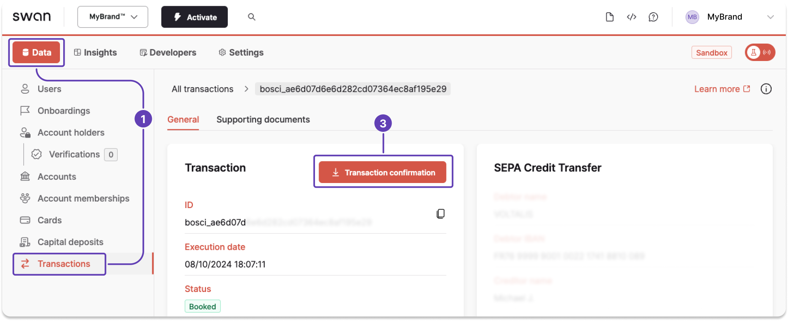

# Generate transaction statements

You can generate a transaction statement with the API.
You can also download transaction statements, referred to as transaction confirmations, from your Dashboard.

:::tip Prerequisites
- The account member has the `canViewAccount` [membership permission](../../accounts/memberships/index.mdx#permissions).
- You have a [project access token](../../../developers/using-api/authentication/guide-get-token-project.mdx).
- The [transaction status](../index.mdx#transactions-statuses) is `Booked`.
- Subscribe to the `TransactionStatement.Generated` [webhook](../../../developers/using-api/webhooks.mdx#events-transactions).
:::

## Supported transaction types {#supported-types}

Transaction confirmation statements are **only** available for incoming and outgoing **SEPA Credit Transfers** (regular and instant) and **International Credit Transfers** with the status **`Booked`**.

Transaction confirmation statements are **not available** for card transactions, SEPA Direct Debit transactions (SDD In or SDD Out), fee transactions, or any other transaction types not explicitly listed above.

For a comprehensive statement including all transaction types and fees, see [account statements](https://docs.swan.io/topics/accounts/overview/guide-generate-statement/).

## API guide {#guide-api}

### Step 1: Generate statement {#api-generate}

1. Call the `generateTransactionStatement` mutation.
1. Add the `transactionId`.
1. Choose the language for your transaction statement.
1. Add the success payload and any information you need, such as the transaction statement ID and status.
1. Add rejections (not shown).

<a href="https://explorer.swan.io?query=bXV0YXRpb24gVHJhbnNhY3Rpb25TdGF0ZW1lbnQgewogIGdlbmVyYXRlVHJhbnNhY3Rpb25TdGF0ZW1lbnQoCiAgICBpbnB1dDogeyB0cmFuc2FjdGlvbklkOiAiJFRSQU5TQUNUSU9OX0lEIiwgbGFuZ3VhZ2U6IGVzIH0KICApIHsKICAgIC4uLiBvbiBHZW5lcmF0ZVRyYW5zYWN0aW9uU3RhdGVtZW50U3VjY2Vzc1BheWxvYWQgewogICAgICBfX3R5cGVuYW1lCiAgICAgIHRyYW5zYWN0aW9uU3RhdGVtZW50IHsKICAgICAgICBjcmVhdGVkQXQKICAgICAgICBpZAogICAgICAgIHN0YXR1c0luZm8gewogICAgICAgICAgc3RhdHVzCiAgICAgICAgICAuLi4gb24gR2VuZXJhdGVkVHJhbnNhY3Rpb25TdGF0ZW1lbnRTdGF0dXNJbmZvIHsKICAgICAgICAgICAgX190eXBlbmFtZQogICAgICAgICAgICBleHBpcmVzQXQKICAgICAgICAgICAgc3RhdHVzCiAgICAgICAgICAgIHVybAogICAgICAgICAgfQogICAgICAgICAgLi4uIG9uIFBlbmRpbmdUcmFuc2FjdGlvblN0YXRlbWVudFN0YXR1c0luZm8gewogICAgICAgICAgICBfX3R5cGVuYW1lCiAgICAgICAgICAgIHN0YXR1cwogICAgICAgICAgfQogICAgICAgICAgLi4uIG9uIEZhaWxlZFRyYW5zYWN0aW9uU3RhdGVtZW50U3RhdHVzSW5mbyB7CiAgICAgICAgICAgIHJlYXNvbgogICAgICAgICAgICBzdGF0dXMKICAgICAgICAgIH0KICAgICAgICAgIC4uLiBvbiBFeHBpcmVkVHJhbnNhY3Rpb25TdGF0ZW1lbnRTdGF0dXNJbmZvIHsKICAgICAgICAgICAgX190eXBlbmFtZQogICAgICAgICAgICBleHBpcmVkQXQKICAgICAgICAgICAgc3RhdHVzCiAgICAgICAgICB9CiAgICAgICAgfQogICAgICB9CiAgICB9CiAgICAuLi4gb24gR2VuZXJhdGlvbk5vdEFsbG93ZWRSZWplY3Rpb24gewogICAgICBfX3R5cGVuYW1lCiAgICAgIG1lc3NhZ2UKICAgIH0KICAgIC4uLiBvbiBWYWxpZGF0aW9uUmVqZWN0aW9uIHsKICAgICAgX190eXBlbmFtZQogICAgICBmaWVsZHMgewogICAgICAgIGNvZGUKICAgICAgICBtZXNzYWdlCiAgICAgICAgcGF0aAogICAgICB9CiAgICAgIG1lc3NhZ2UKICAgIH0KICAgIC4uLiBvbiBGb3JiaWRkZW5SZWplY3Rpb24gewogICAgICBfX3R5cGVuYW1lCiAgICAgIG1lc3NhZ2UKICAgIH0KICAgIC4uLiBvbiBUcmFuc2FjdGlvbk5vdEZvdW5kUmVqZWN0aW9uIHsKICAgICAgX190eXBlbmFtZQogICAgICBtZXNzYWdlCiAgICAgIHRyYW5zYWN0aW9uSWQKICAgIH0KICB9Cn0K&tab=api" className="explorer-badge">Open in API Explorer</a>

```graphql {4-5,8} showLineNumbers
mutation TransactionStatement {
  generateTransactionStatement(
    input: {
      transactionId: "$TRANSACTION_ID"
      language: es
    }
  ) {
    ... on GenerateTransactionStatementSuccessPayload {
      __typename
      transactionStatement {
        createdAt
        id
        statusInfo {
          status
          ... on PendingTransactionStatementStatusInfo {
            __typename
            status
        }
      }
    }
  }
}
```

### Step 2: Get transaction statement ID {#api-get-id}

Get the `transactionStatement` > `id` from the success payload (line 7).

:::warning
This is the only way to get the `transactionStatement` > `id`.
Copy it immediately to use in step 3.
:::

```json {7} showLineNumbers
{
  "data": {
    "generateTransactionStatement": {
      "__typename": "GenerateTransactionStatementSuccessPayload",
      "transactionStatement": {
        "createdAt": "2024-09-26T15:31:38.742Z",
        "id": "$TRANSACTION_STATEMENT_ID",
        "statusInfo": {
          "status": "Pending",
          "__typename": "PendingTransactionStatementStatusInfo"
        }
      }
    }
  }
}
```

### Step 3: Retrieve download URL {#api-retrieve-url}

After generating the transaction statement, you receive a `TransactionStatement.Generated` webhook notification letting you know the statement can be downloaded by URL.
The URL is valid for **seven days**.

1. Call the `transactionStatement` query.
1. Add the `transactionStatement` > `id`.
1. Add `statusInfo` for all statuses. The URL to download the statement is provided in `statusInfo` > `GeneratedTransactionStatementStatusInfo` > `url` (line 11).

<a href="https://explorer.swan.io?query=cXVlcnkgR2V0U3RhdGVtZW50VXJsIHsKICB0cmFuc2FjdGlvblN0YXRlbWVudChpZDogIiRUUkFOU0FDVElPTl9TVEFURU1FTlRfSUQiKSB7CiAgICBjcmVhdGVkQXQKICAgIHVwZGF0ZWRBdAogICAgc3RhdHVzSW5mbyB7CiAgICAgIHN0YXR1cwogICAgICAuLi4gb24gR2VuZXJhdGVkVHJhbnNhY3Rpb25TdGF0ZW1lbnRTdGF0dXNJbmZvIHsKICAgICAgICBfX3R5cGVuYW1lCiAgICAgICAgZXhwaXJlc0F0CiAgICAgICAgc3RhdHVzCiAgICAgICAgdXJsCiAgICAgIH0KICAgICAgLi4uIG9uIEV4cGlyZWRUcmFuc2FjdGlvblN0YXRlbWVudFN0YXR1c0luZm8gewogICAgICAgIF9fdHlwZW5hbWUKICAgICAgICBleHBpcmVkQXQKICAgICAgICBzdGF0dXMKICAgICAgfQogICAgICAuLi4gb24gRmFpbGVkVHJhbnNhY3Rpb25TdGF0ZW1lbnRTdGF0dXNJbmZvIHsKICAgICAgICByZWFzb24KICAgICAgICBzdGF0dXMKICAgICAgfQogICAgICAuLi4gb24gUGVuZGluZ1RyYW5zYWN0aW9uU3RhdGVtZW50U3RhdHVzSW5mbyB7CiAgICAgICAgX190eXBlbmFtZQogICAgICAgIHN0YXR1cwogICAgICB9CiAgICB9CiAgfQp9Cg%3D%3D&tab=api" className="explorer-badge">Open in API Explorer</a>

```graphql {2,7,11} showLineNumbers
query GetStatementUrl {
  transactionStatement(id: "$TRANSACTION_STATEMENT_ID") {
    createdAt
    updatedAt
    statusInfo {
      status
      ... on GeneratedTransactionStatementStatusInfo {
        __typename
        expiresAt
        status
        url
      }
    }
  }
}
```

### Step 4: Download statement {#api-download}

Use the `url` to download the statement within **seven days** of generation.

1. Copy the `url` from the payload (line 10).
1. Paste the `url` into your preferred browser.
1. The document downloads automatically after you press enter.

```json {10} showLineNumbers
{
  "data": {
    "transactionStatement": {
      "createdAt": "2024-09-26T16:08:55.512Z",
      "updatedAt": "2024-09-26T16:08:55.512Z",
      "statusInfo": {
        "status": "Generated",
        "__typename": "GeneratedTransactionStatementStatusInfo",
        "expiresAt": "2024-10-03T16:09:01.286Z",
        "url": "$YOUR_DOWNLOAD_URL"
      }
    }
  }
}
```

:::danger Troubleshooting
If the [transaction statement status](../index.mdx#transactions-statements-statuses) is `Failed` or `Expired`, **return to step 1** to generate your statement again.
:::

## Dashboard {#guide-dashboard}

1. On your Dashboard, go to **Data** > **Transactions**.
1. **Open the eligible transaction** for which you'd like to download an account confirmation statement (not shown). The transaction status must be `Booked`.
1. Click **Transaction confirmation**, triggering the generation and download of the document automatically.



:::caution Eligible transactions
Transaction confirmation statements are only available for incoming and outgoing **SEPA Credit Transfers**, **Instant SEPA Credit Transfers**, and **International Credit Transfers** with the status **`Booked`**.
The transaction confirmation button **doesn't appear** for ineligible transactions.

Transaction confirmation statements are **different from account statements**, which include all booked transactions.
:::