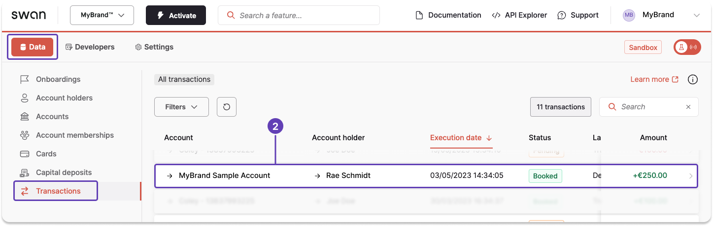
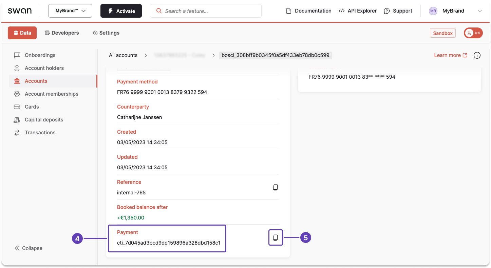

# Get a payment ID

You can get payment IDs with the API or on your Dashboard.

## Dashboard

All payment IDs for your project are on your Dashboard.

1. On your Dashboard, go to **Data** > **Transactions**.
1. **Open** a transaction connected to the payment you're searching for.
This will redirect you to a transaction page for a specific account.



3. **Scroll** to the bottom of the page.
1. Located the information named **Payment**.
1. Click to copy the payment ID.



## API guide

Queries are highly customizable.
This guide focuses solely on using the `payment` query to get payment IDs. 
Learn more about this query in the guide to [get payment information](./guide-get-payment-info.mdx).

1. Call the `payments` query.
1. Check the boxes for `edges` and `node`.
1. Under `node`, check the boxes for `id` and `createdAt`.
    * `createdAt` could help you identity the payment ID you're searching for if you know when the payment was initiated.
    * You might choose to get only the `first` 10 IDs on the list, use [pagination](../../../developers/using-api/pagination.mdx) to filter further, or add a `totalCount`.

### Query

🔎 [Open the query in API Explorer](https://explorer.swan.io?query=cXVlcnkgR2V0UGF5bWVudElkIHsKICBwYXltZW50cyhmaXJzdDogMTApIHsKICAgIGVkZ2VzIHsKICAgICAgbm9kZSB7CiAgICAgICAgaWQKICAgICAgICBjcmVhdGVkQXQKICAgICAgfQogICAgfQogICAgdG90YWxDb3VudAogIH0KfQo%3D&tab=api)

```graphql {2,5-6,9} showLineNumbers
query GetPaymentId {
  payments(first: 5) {
    edges {
      node {
        id
        createdAt
      }
    }
    totalCount
  }
}
```
### Payload

Find the transaction ID you need in the returned information.
If the payload contents aren't sufficient, run the query again with modified parameters.

```json {7-8,13-14,19-20,25-26,31-32,36} showLineNumbers
{
  "data": {
    "payments": {
      "edges": [
        {
          "node": {
            "id": "cto_70f4f83c243e5235f8e75818d660199a",
            "createdAt": "2023-05-15T12:49:02.779Z"
          }
        },
        {
          "node": {
            "id": "cto_631d8374a0bd35b004e887c49b32a334",
            "createdAt": "2023-05-15T11:33:25.785Z"
          }
        },
        {
          "node": {
            "id": "cti_7d045ad3bcd9dd159896a328dbd158c1",
            "createdAt": "2023-05-03T12:34:05.227Z"
          }
        },
        {
          "node": {
            "id": "cti_4e29152507d799f69f67e1bc5056c7af",
            "createdAt": "2023-03-30T14:34:37.176Z"
          }
        },
        {
          "node": {
            "id": "cto_d3bd55aeaed728d812b87c7b28d2dc72",
            "createdAt": "2023-03-30T14:22:22.995Z"
          }
        }
      ],
      "totalCount": 26
    }
  }
}
```