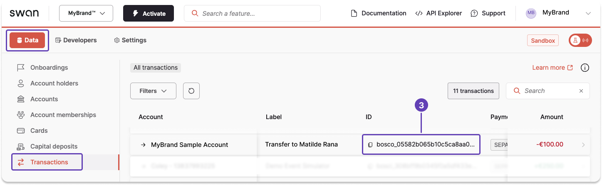

# Get a transaction ID

You can get transactions IDs with the API or on your Dashboard.

## Dashboard

All transaction IDs for your project are on your Dashboard.

1. On your Dashboard, go to **Data** > **Transactions**.
1. Find the transaction you need.
1. Scroll horizontally to locate the transaction ID, then click to copy.



## API guide

Queries are highly customizable.
This guide focuses solely on using the `transactions` query to get transaction IDs.
Learn more about this query in the guide to [get transaction information](./guide-get-transaction-info.mdx).

1. Call the `transactions` query.
1. Check the boxes for `edges` and `node`.
1. Under `node`, check the boxes for `id`, `createdAt`, and `label`.
   - `label` often contains a name, which might be helpful.
   - `createdAt` could help you identity the payment ID you're searching for if you know when the payment was initiated.
   - Additionally, you might choose to get only the `first` 10 IDs on the list, use [pagination](../../../developers/using-api/pagination.mdx) to filter further, or add a `totalCount`.

### Query

🔎 [Open the query in API Explorer](https://explorer.swan.io?query=cXVlcnkgR2V0VHJhbnNhY3Rpb25JZCB7CiAgdHJhbnNhY3Rpb25zIHsKICAgIGVkZ2VzIHsKICAgICAgbm9kZSB7CiAgICAgICAgaWQKICAgICAgICBjcmVhdGVkQXQKICAgICAgICBsYWJlbAogICAgICB9CiAgICB9CiAgICB0b3RhbENvdW50CiAgfQp9Cg%3D%3D&tab=api)

```graphql {2,5-7,10} showLineNumbers
query GetTransactionId {
  transactions {
    edges {
      node {
        id
        createdAt
        label
      }
    }
    totalCount
  }
}
```

### Payload

```json {3,7-9,14-16,20} showLineNumbers
{
  "data": {
    "transactions": {
      "edges": [
        {
          "node": {
            "id": "bosco_05582b065b10c5ca8aa03342bb1cf389",
            "createdAt": "2023-05-15T11:34:10.101Z",
            "label": "Transfer to Matilde Rana"
          }
        },
        {
          "node": {
            "id": "bosci_00d62797731fb95ee2f91ca32f4165e9",
            "createdAt": "2023-03-30T13:24:39.477Z",
            "label": "Transfer from Sasha Oliveira"
          }
        }
      ],
      "totalCount": 2
    }
  }
}
```
