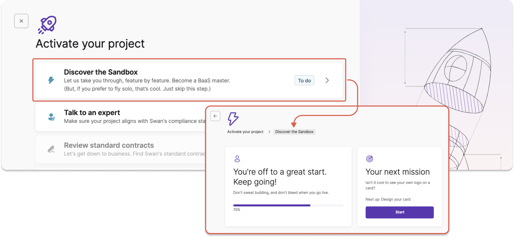
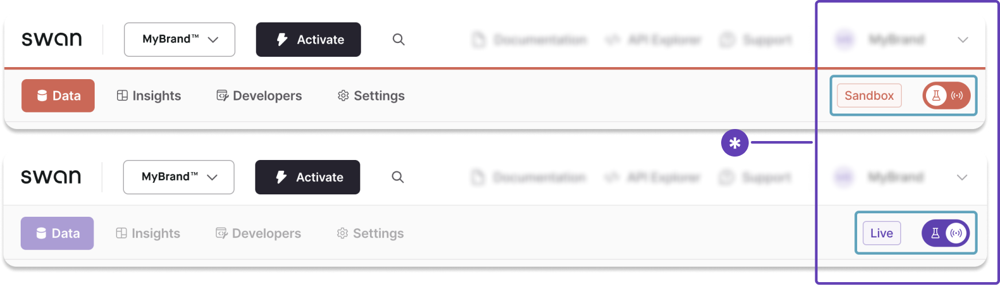

# Activate your project

Transforming your Sandbox project into a Live project that can manage funds is a multi-step process.

The order in which you complete these steps can vary.
Please note that you can **send the materials for step 9** as soon as they're ready, regardless of where you are in this process.

:::info Activation progress
You can view your progress anytime by clicking the **Activate** button in your Dashboard's top navigation.
You'll see an interactive list of everything you still need to do, as well as the steps you already completed.

:::

## Step 1: Discover the Sandbox

On your Dashboard, go to **Activate** > **Discover the Sandbox**.
Complete the list of tasks to learn more about the Dashboard and the Swan offer.

- Configure your design
- Open your first Sandbox account
- Send and receive your first transfers
- Design, issue, and use your first card
- Add your first account member
- Set up your first webhook

If you prefer to learn on your own, feel free to use the documentation to perform these tasks.

## Step 2: Talk to a Swan expert

On your Dashboard, go to **Activate** > **Talk to an expert**.

Enter your professional email and, optionally, your LinkedIn profile link.
Then, explain in a few words how you plan to use Swan.

A Swan expert will follow up quickly to discuss your product vision and make sure your plan aligns with Swan's compliance standards.

Consider discussing [Swan's integration options](https://docs.swan.io/guide/choose-integration) with your expert.

## Step 3: Send Swan your project ID

*Note: Step 3 isn't on the Dashboard list.*

Swan needs your project ID to continue opening your first Live account.

1. On the Dashboard, toggle open the section with your project name.
1. Click-to-copy your project ID.
1. Send your project ID to your Swan expert by email.

## Step 4: Review standard contracts

On your Dashboard, go to **Activate** > **Review standard contracts**.

Take a look at Swan's standard contracts.
Let your expert know if you have any questions. 

## Step 5: Get compliance approval

As a regulated financial institution, Swan must review every project.
When you reach this step, your review has already begun.

In parallel with your project review, make sure you've **signed the contract** with the Swan sales team.
Your project will only be activated after the verification process is complete and the contract is signed.

## Step 6: Open your company's first Live account

On your Dashboard, go to **Activate** > **Open your company's first Live account**.

Complete the form in this section, then upload any required documents and verify your identity.

Opening and using this account is a great way to learn first hand how accounts work in real life.

:::caution French IBAN
The first Live account is **always** a French account with a French IBAN, regardless of where you're located.
:::

## Step 7: Start using the Live API

After Swan approves your project, switch from Sandbox to Live by changing the toggle.
The Dashboard accent color will change from orange to purple, and the label from Sandbox to Live.
You can start using your account immediately, and continue to test your integration.

After switching to Live, make sure to go to **Dashboard** > **Developers** to **generate new Live OAuth 2.0 credentials**.

## Step 8: Configure your branding in Live

*Note: Step 8 isn't on the Dashboard list.*

Data doesn't transfer from Sandbox to Live.
Therefore, you need to configure your branding in your Live environment.

1. Go to **Dashboard** > **Settings**.
1. Open **Branding**.
1. Upload a PNG of your logo and choose your accent color.
1. Click **Start review**.

Swan reviews all branding changes.
As soon as your branding is approved, you'll see it in your Live project environment.

## Step 9: Get your final integration review

Every integration must pass a final technical review.
Swan also reviews all materials that mention Swan and Swan features.

Please send the following materials to compliance@swan.io to start your final review:

1. Explanation of how you present your offer and where you market Swan features. Please make sure to review [Swan's guidelines](https://docs.swan.io/regulatory/status-options#proper-way-to-present-your-offer) when creating these materials.
1. Link your clients will use to open their Swan accounts.
1. Access to your userflow (in your staging environment).
1. Your terms and conditions.
1. Your privacy policy.

The final review can take time (usually about one week).
You can send these materials to Swan as soon as they're ready, even if you are early in the activation process.