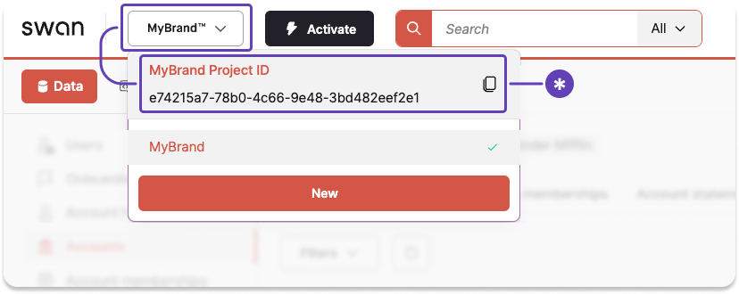

# Projects overview

Using Swan means using projects.

**Partners** can have anywhere from one project to a large number of projects depending on the implementation.
Typically, there is one project per use case.
**Users** can belong to as many projects as needed.
They always use the **same identifier** (their phone number) to sign in.

## Project owner {#owner}

Projects are owned by the **legal entity** who opens a **project's first Live account** when activating a Swan project.

Additionally, the project owner's **legal representative** can perform specific actions, for example implementing security measures such as server consent or viewing their own card numbers with the API.

In Sandbox, you can use the mutation `promoteAccountHolderToProjectOwner` to promote any account holder to test project owner behavior.

## Project ID {#id}

Each project has a unique project ID (`projectId`).
On the Dashboard, click-to-copy your Project ID from any page.

## Project access tokens {#access-tokens}

Project access tokens serve several functions:

1. Allow you to **act on your own behalf** rather than on behalf of a user.
1. Allow you to **act as a user within your project**, sometimes referred to as [impersonation](../../developers/using-api/authentication/guide-impersonate.mdx).
1. Must use the **client credentials** OAuth 2.0 flow (also referred to as *grant type*), intended for server-to-server authentication.

Learn more about project access tokens, including [how to get them](../../developers/using-api/authentication/guide-get-token-project.mdx), in the [authentication](../../developers/using-api/authentication/index.mdx) section.

## Sandbox and Live projects {#environments}

Projects always start as Sandbox-only.
Projects can remain Sandbox-only if you're goal for the project is to test various implementations.

After a project passes to the status `LimitedLiveAccess`, the project owner can begin testing the Live implementation.
From there, more and more Live access is granted (assuming the project passes reviews).

After a project is Live, you can switch between Sandbox and Live.
Use Sandbox to test new features before releasing them to your Live users.

For regulatory reasons, it's **not possible to delete projects** or clear data from a project.

:::caution Can't move between projects
You can't migrate work between projects.
If you have a Live project and you'd like to test an implementation in Sandbox before launching, use that Live project's Sandbox mode.
:::

## Project statuses {#statuses}

| Status | Explanation |  Live available | Onboarding available |
| --- | --- | --- | --- |
| `Initiated` | Partner creates a project  **Next**: Partner schedules meeting with Swan | ❌ No | ❌ No |
| `MeetingScheduled` | Partner schedules a meeting  **Next**: Partner and Swan meet to discuss the Partner's use case and implementation before requesting a review | ❌ No | ❌ No |
| `PendingCompliance` | Swan performs a review of the project for risk and compliance reasons  **Next**: Partner starts investigative development of their implementation while Swan performs the review  | ❌ No | ✅ Yes for project owner only  ❌ No for users and companies |  
| `LimitedLiveAccess` | Review accepted; Partner can use Swan for *their own account only*  **Next**: Partner continues testing their development, then requests a review | ✅ Yes | ❌ No |
| `PendingLiveReview` | Partner asks Swan to review; Swan performs a technical review of the Live implementation  **Next**: Partner stays responsive to questions as Swan performs Live review | ✅ Yes | ❌ No |
| `BetaLiveAccess` | Swan approves implementation for a limited number of Live accounts  **Next**: Partner begins onboarding a limited number of accounts  | ✅ Yes | ✅ Yes *(limited)* |
| `FullLiveAccess` | Swan approves implementation for full Live access  **Next**: Partner uses their Swan implementation | ✅ Yes | ✅ Yes *(unlimited)* |
| `Disabled` | Project is not longer active (could be due to Partner request, Swan's choice, or a mutual decision)  **Next**: *No next steps* | ❌ No | ❌ No |
| `Suspended` | Project is suspended, either pending a review by Swan or at the Partner's request  **Next**: If due to *Swan review*, Partner stays responsive to questions as Swan performs the review; if due to *Partner request*, the Partner should communicate with Swan about reactivating the project | ❌ No | ❌ No |
| `Rejected` | Swan rejects the project (reasons vary and are communicated to the Partner or main point of contact)  **Next**: *No next steps* | ❌ No | ❌ No |

## Notifications {#notifications}

Send notifications to your end users automatically when certain events occur. 
Notifications are delivered in the [account membership language](../accounts/memberships/index.mdx#language).

The following tables list information about the available text message and email notifications.
Take note of the [account membership permissions](../accounts/memberships/index.mdx#permissions) required to receive each notification.
Account members won't receive the notification if they don't have the required permission.

### Text message notifications {#notifications-text-message}

| Event | Notification | Permission required |
| --- | --- | --- |
| Card payment rejected due to **insufficient funds** | Your card payment was rejected due to insufficient funds. Please add money to your account before trying again. | `CanViewAccount` |
| Card payment rejected because the cardholder has already **reached their [spending limit](../cards/index.mdx#limits)** | Your card payment was rejected because you reached the card's spending limit. Try again when your spending limit resets, or ask to increase it. | *None* |
| Card payment rejected because the card is **permanently blocked [(canceled)](../cards/physical/index.mdx#statuses)** | Your card payment was rejected because the card is permanently blocked. Please order a new card. | *None* |
| Card payment rejected because the cardholder entered the **[incorrect PIN](../cards/physical/index.mdx#pin-incorrect-attempts)** | Your card payment was rejected because the PIN wasn’t correct. Please check your PIN before trying again. | *None* |
| Card payment rejected because the cardholder entered an **invalid expiration date** | Your card payment was rejected because the expiration date is invalid. Please confirm your card isn’t expired before trying again. | *None* |

### Email notifications {#notifications-email}

| Event | Notification | Permission required |
| --- | --- | --- |
| Physical card is about to expire and goes into `ToRenew` **[status](../cards/physical/index.mdx#renew-statuses)** 10 weeks before the expiration date | White-label email sent 10 weeks before card expiry. The email reminds the user about the upcoming expiration date. It includes the current delivery address and asks them to update it in their banking app within two weeks if it's incorrect. | *None* |

## Guides {#guides}

* [Activate your project](./guide-activate.mdx)