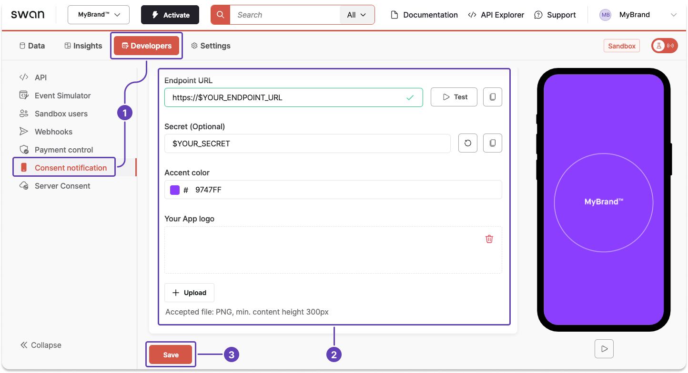

# Configure consent notifications

You can declare a preferred notification channel for your users and configure how your consent notifications appear.

Please note that if you're using **Swan's Web Banking interface**, Swan sends a text message to your users for one-time passwords, logins, and consents, regardless of preferred channel and configuration.

:::info Timeout
Your integration has three seconds to respond to a consent notification.
If your response is anything other than a `200 OK HTTP`, or there's no response at all, Swan redirects the user to the standard text message consent flow.
:::

## Declare preferred notification channel {#declare-channel}

You can specify how your user would like to receive consent notifications, referred to as their preferred channel.

1. Call the `updateUserConsentSettings` mutation with a project access token.
1. Enter the user's `userId`.
1. Choose the preferred channel:
    1. `Sms` (default value): Swan sends a text message to the user with the SCA link to open on their mobile device.
    1. `App`: You receive a notification, then send the SCA link to your user yourself.

### Mutation {#mutation}

<a href="https://explorer.swan.io?query=bXV0YXRpb24gUHJlZmVycmVkQ2hhbm5lbCB7CiAgdXBkYXRlVXNlckNvbnNlbnRTZXR0aW5ncygKICAgIGlucHV0OiB7IHVzZXJJZDogIiRZT1VSX1VTRVJfSUQiLCBwcmVmZXJyZWROb3RpZmljYXRpb25DaGFubmVsOiBTbXMgfQogICkgewogICAgLi4uIG9uIFVwZGF0ZVVzZXJDb25zZW50U2V0dGluZ3NTdWNjZXNzUGF5bG9hZCB7CiAgICAgIF9fdHlwZW5hbWUKICAgICAgdXNlckNvbnNlbnRTZXR0aW5ncyB7CiAgICAgICAgcHJlZmVycmVkTm90aWZpY2F0aW9uQ2hhbm5lbAogICAgICB9CiAgICB9CiAgICAuLi4gb24gVXBkYXRlVXNlckNvbnNlbnRTZXR0aW5nc1Rva2VuUmVqZWN0aW9uIHsKICAgICAgX190eXBlbmFtZQogICAgICBtZXNzYWdlCiAgICB9CiAgfQp9Cg%3D%3D&tab=api" className="explorer-badge">Open in API Explorer</a>

```graphql {4-5} showLineNumbers
mutation PreferredChannel {
  updateUserConsentSettings(
    input: {
      userId: "$YOUR_USER_ID"
      preferredNotificationChannel: Sms
    }
  ) {
    ... on UpdateUserConsentSettingsSuccessPayload {
      __typename
      userConsentSettings {
        preferredNotificationChannel
      }
    }
    ... on UpdateUserConsentSettingsTokenRejection {
      __typename
      message
    }
  }
}
```

### Payload {#payload}

Notice the preferred channel `Sms` (line 6).

```json {6} showLineNumbers
{
  "data": {
    "updateUserConsentSettings": {
      "__typename": "UpdateUserConsentSettingsSuccessPayload",
      "userConsentSettings": {
        "preferredNotificationChannel": "Sms"
      }
    }
  }
}
```

## Configure consent notification {#configure-channel}

Configure your consent notification on your Dashboard.

1. Go to **Dashboard** > **Developers** > **Consent notification**.
1. Enter your endpoint, secret key, accent color, and logo.
1. Click **Save**.



Along with a notification, you'll receive an `authorizationUrl` and the `consent` object to display to your user on their mobile.
On desktop, Swan displays the `consentUrl`.

While consent is ongoing, the user's mobile plays a repeated image with your accent color and logo.