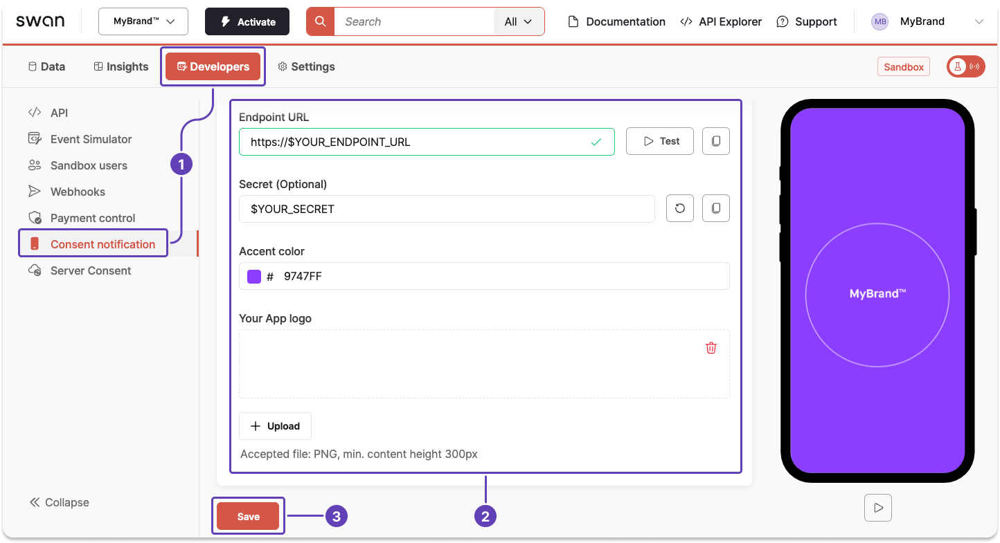

# Configure consent notifications

You can declare a preferred notification channel for your users and configure how your consent notifications appear.

Please note that if you're using **Swan's Web Banking interface**, Swan sends a text message to your users for one-time passwords, logins, and consents, regardless of preferred channel and configuration.

:::info Consent flows only
Consent notifications are only available for Consent flows (sensitive operations). They cannot be used for OAuth flows such as login or authentication.
:::

:::info Timeout
Your integration has two seconds to respond to a consent notification.
If your response is anything other than a `200 OK HTTP`, or there's no response at all, Swan redirects the user to the standard text message consent flow.
This timeout complies with 3-D Secure (3DS) requirements.
:::

## When to use consent notifications {#when-to-use}

Consent notifications are relevant when your partner has both desktop and mobile apps, or when you want to optimize 3-D Secure (3DS) on mobile.

## How consent notifications work {#how-it-works}

By default, when a user performs a sensitive operation on desktop and needs to consent, Swan sends an SMS to their smartphone with the consent link.

With consent notifications configured, when a user performs a sensitive operation on desktop, your mobile app receives a notification so the user can consent inside your mobile app. This redirects desktop users to your mobile app to give consent.

Think of consent notifications as another way to give consent alongside SMS and QR codes. This is similar to how some purchases on desktop sometimes require approval from your banking app: you initiate an action on desktop and approve it on your mobile app.

## Declare preferred notification channel {#declare-channel}

You can specify how your user would like to receive consent notifications, referred to as their preferred channel.

1. Call the `updateUserConsentSettings` mutation with a project access token.
1. Enter the user's `userId`.
1. Choose the preferred channel:
    1. `Sms` (default value): Swan sends a text message to the user with the SCA link to open on their mobile device.
    1. `App`: You receive a notification, then send the SCA link to your user yourself.

### Mutation {#mutation}

<a href="https://explorer.swan.io?query=bXV0YXRpb24gUHJlZmVycmVkQ2hhbm5lbCB7CiAgdXBkYXRlVXNlckNvbnNlbnRTZXR0aW5ncygKICAgIGlucHV0OiB7IHVzZXJJZDogIiRZT1VSX1VTRVJfSUQiLCBwcmVmZXJyZWROb3RpZmljYXRpb25DaGFubmVsOiBTbXMgfQogICkgewogICAgLi4uIG9uIFVwZGF0ZVVzZXJDb25zZW50U2V0dGluZ3NTdWNjZXNzUGF5bG9hZCB7CiAgICAgIF9fdHlwZW5hbWUKICAgICAgdXNlckNvbnNlbnRTZXR0aW5ncyB7CiAgICAgICAgcHJlZmVycmVkTm90aWZpY2F0aW9uQ2hhbm5lbAogICAgICB9CiAgICB9CiAgICAuLi4gb24gVXBkYXRlVXNlckNvbnNlbnRTZXR0aW5nc1Rva2VuUmVqZWN0aW9uIHsKICAgICAgX190eXBlbmFtZQogICAgICBtZXNzYWdlCiAgICB9CiAgfQp9Cg%3D%3D&tab=api" className="explorer-badge">Open in API Explorer</a>

```graphql {4-5} showLineNumbers
mutation PreferredChannel {
  updateUserConsentSettings(
    input: {
      userId: "$YOUR_USER_ID"
      preferredNotificationChannel: Sms
    }
  ) {
    ... on UpdateUserConsentSettingsSuccessPayload {
      __typename
      userConsentSettings {
        preferredNotificationChannel
      }
    }
    ... on UpdateUserConsentSettingsTokenRejection {
      __typename
      message
    }
  }
}
```

### Payload {#payload}

Notice the preferred channel `Sms` (line 6).

```json {6} showLineNumbers
{
  "data": {
    "updateUserConsentSettings": {
      "__typename": "UpdateUserConsentSettingsSuccessPayload",
      "userConsentSettings": {
        "preferredNotificationChannel": "Sms"
      }
    }
  }
}
```

## Configure consent notification {#configure-channel}

Configure your consent notification on your Dashboard.

1. Go to **Dashboard** > **Developers** > **Consent notification**.
1. Enter your endpoint, secret key, accent color, and logo.
1. Click **Save**.



Along with a notification, you'll receive an `authorizationUrl` and the `consent` object to display to your user on their mobile.
On desktop, Swan displays the `consentUrl`.

While consent is ongoing, the user's mobile plays a repeated image with your accent color and logo.

## Tips & recommendations {#tips}

- If Swan detects the user is already on a mobile app, Swan uses a mobile consent flow and doesn't send an SMS. This is different from consent notifications, which enable communication between browser and mobile app for in-app notification consent instead of SMS.
- 3DS always uses SMS regardless of whether you're on desktop or mobile. However, you can use consent notifications to optimize 3DS UX by setting `preferredNotificationChannel: App`. When configured, users performing 3DS card payment validation receive an in-app notification instead of an SMS, containing a consent link that opens the consent app directly on their phone.
- As of January 2025, consent notifications automatically fall back to SMS if your endpoint doesn't respond correctly. This applies to all flows, including 3DS. Users can also manually choose to receive SMS instead with a button on the consent screen.