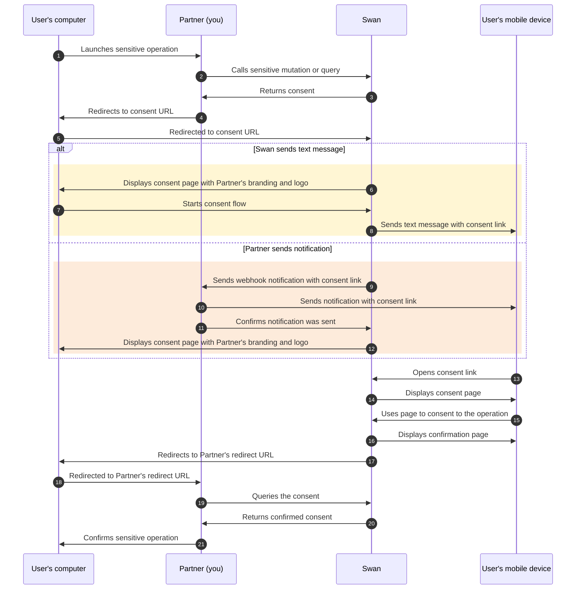
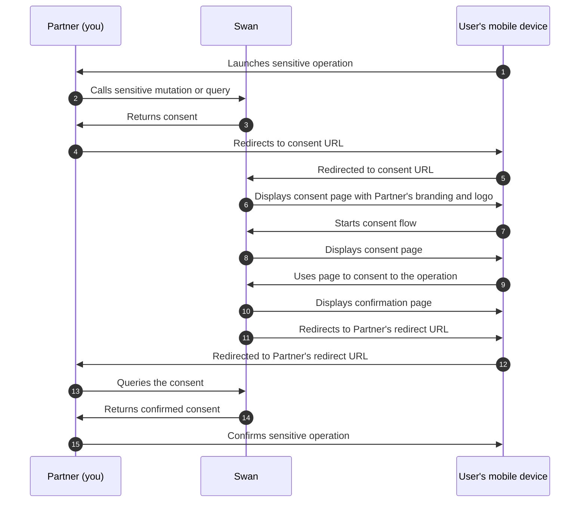
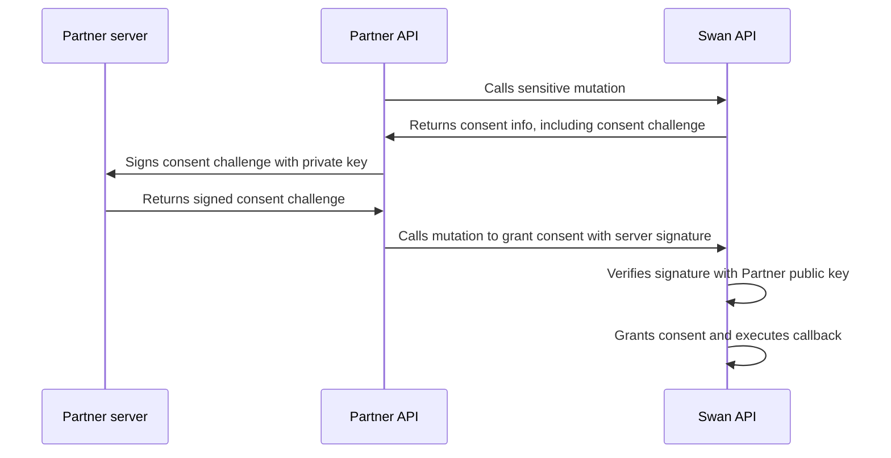

# Consent

## Overview {#overview}

Consent is built-in to Swan's offer, meaning you don't handle it yourself.
In fact, you can't—it's part of Swan's [regulatory responsibility](../../../../partnership/index.mdx#license) to manage consent.

Additionally, **consent can't be deactivated**.
When using the Sandbox environment, you can [activate the auto consent setting](../../../../developers/tools/sandbox-users.mdx#settings) for your Sandbox users.

Some operations at Swan are considered sensitive, and **sensitive operations always require user consent**.
To perform sensitive operations **using the API**, you need authenticate with an access token.
You can either use a [user access token](../../../../developers/using-api/authentication/index.mdx#tokens-user) in the name of the user wanting to make the payment, or with a [project access token](../../../../developers/using-api/authentication/index.mdx#tokens-project) impersonating that user.
Users must consent to granting a user access token.

## Strong Customer Authentication (SCA) {#sca}

To protect the user and comply with legal requirements, users can only provide consent through Strong Customer Authentication (SCA).

SCA is a requirement of the EU Revised Directive on Payment Services (PSD2) to payment service providers within the European Economic Area.
The requirement mandates **multi-factor authentication** to increase the security of electronic payments.
All Swan consent processes use SCA.

### SCA user experience {#sca-user}

Though there's much more happening technically, the user experience to consent to sensitive operations is straightforward and typically quick. 

1. The **user receives the consent link** in a text message from Swan or a notification from you.
1. The user **opens the link** and follows the instructions.
1. The user **verifies their identity** by entering their 6-digit passcode, using biometrics, or using a passkey.
1. If the user **doesn't receive a text message**, they can either request the text message be sent again or consent by scanning a QR code.
1. The user is then redirected to your predefined `redirectUrl`.

:::caution Text message and link validity
**Text messages are only valid for 5 minutes**, and consent links **time out 20 minutes after** being opened.
:::

If you refer to the [consent sequence diagrams](#consent-diagrams), this user experience occurs when the user opens the consent link and completes the consent request.
Look for the arrow description `Uses page to consent to the operation`.

## List of sensitive operations {#sensitive}

The following mutations concern sensitive operations and require consent.
All links lead to the mutation's API Reference page.
Mutations marked with two arrows [⮂] are eligible for [server-to-server consent](#s2s).

<h3 id="sensitive-accounts">Accounts</h3>

- [`closeAccount`](https://api-reference.swan.io/mutations/close-account/)

<h3 id="sensitive-account-memberships">Account memberships</h3>

- [`addAccountMembership`](https://api-reference.swan.io/mutations/add-account-membership/)
- [`addAccountMemberships`](https://api-reference.swan.io/mutations/add-account-memberships/)
- [`suspendAccountMembership`](https://api-reference.swan.io/mutations/suspend-account-membership/)
- [`resumeAccountMembership`](https://api-reference.swan.io/mutations/resume-account-membership/)
- [`updateAccountMembership`](https://api-reference.swan.io/mutations/update-account-membership/)

<h3 id="sensitive-cards">Cards</h3>

- **Adding cards**:
    - [`addCard`](https://api-reference.swan.io/mutations/add-card/) ⮂
    - [`addCards`](https://api-reference.swan.io/mutations/add-cards/) ⮂
    - [`addCardsWithGroupDelivery`](https://api-reference.swan.io/mutations/add-cards-with-group-delivery/) ⮂
    - [`addDigitalCard`](https://api-reference.swan.io/mutations/add-digital-card/)
    - [`addSingleUseVirtualCard`](https://api-reference.swan.io/mutations/add-single-use-virtual-card/) ⮂
    - [`addSingleUseVirtualCards`](https://api-reference.swan.io/mutations/add-single-use-virtual-cards/) ⮂
- **Virtual cards**:
    - [`updateCard`](https://api-reference.swan.io/mutations/update-card/) ⮂
    - [`viewCardNumbers`](https://api-reference.swan.io/mutations/view-card-numbers/)
- **Physical cards**:
    - [`printPhysicalCard`](https://api-reference.swan.io/mutations/print-physical-card/) ⮂
    - [`activatePhysicalCard`](https://api-reference.swan.io/mutations/activate-physical-card/) ⮂
    - [`resumePhysicalCard`](https://api-reference.swan.io/mutations/resume-physical-card/) ⮂
    - [`viewPhysicalCardNumbers`](https://api-reference.swan.io/mutations/view-physical-card-numbers/)
    - [`viewPhysicalCardPin`](https://api-reference.swan.io/mutations/view-physical-card-pin/)

<h3 id="sensitive-funding">Funding</h3>

- [`addDirectDebitFundingSource`](https://api-reference.swan.io/mutations/add-direct-debit-funding-source/) ⮂
- [`initiateFundingRequest`](https://api-reference.swan.io/mutations/initiate-funding-request/) ⮂

<h3 id="sensitive-payments-transactions">Payments and transactions</h3>

- **Credit transfers**:
    - [`initiateCreditTransfers`](https://api-reference.swan.io/mutations/initiate-credit-transfers/) ⮂
    - [`scheduleStandingOrder`](https://api-reference.swan.io/mutations/schedule-standing-order/) ⮂
- **Direct debit payment mandates**:
    - [`addReceivedSepaDirectDebitB2bMandate`](https://api-reference.swan.io/mutations/add-received-sepa-direct-debit-b2-b-mandate/) ⮂
    - [`enableReceivedDirectDebitMandate`](https://api-reference.swan.io/mutations/enable-received-direct-debit-mandate/) ⮂
    - [`updateReceivedSepaDirectDebitB2bMandate`](https://api-reference.swan.io/mutations/update-received-sepa-direct-debit-b2-b-mandate/) ⮂
- **Other**:
    - [`refund`](https://api-reference.swan.io/mutations/refund/) ⮂

## Multi-consents {#multi-consent}

Multi-consent allows you to group multiple consents for sensitive operations into a single consent, so your user can **consent to multiple operations at the same time**.
For example, your user could consent to adding a card, adding an account membership, and initiating a credit transfer, all at once.
Creating a multi-consent is an asynchronous operation, and you can group up to **100 child consents** into one multi-consent.

When the user consents to the multi-consent, the status changes to `OperationComitting` and the user is informed their multi-consent is complete.
Note that child consents aren't processed immediately.

As the multi-consent executes, if any child consent fails, the status of the whole multi-consent changes to `Failed`.
Any child consents that were `Accepted` before the failed child consent remain valid.
Any child consents that were still waiting to be executed are canceled.

Since execution is asynchronous, consider subscribing to [consent webhooks](../../../../developers/using-api/webhooks.mdx#events-consent) to stay updated on the progress of each child consent.

Learn how to **create a multi-consent** in the [dedicated guide](./guide-create-multiconsent.mdx).

## Notification preferences {#notifications}

You can specify how your user would like to receive consent notifications, referred to as their preferred channel.
Swan offers two possibilities:

1. Swan sends a text message to the user, which includes the SCA link the user needs to open on their mobile device.
1. You receive a notification, then you send the SCA link to your user. This is only possible if you have your own mobile app.

If you choose to receive the notification and send it to your user, you'll need to configure your notifications.
Learn how to **specify notification preferences** and **configure your own notifications** in the [dedicated guide](./guide-configure-notifications.mdx).

:::info Web Banking interface
If you're using Swan's Web Banking interface, Swan sends a text message to your users for one-time passwords, logins, and consents, regardless of preferred channel and notification configuration.
:::

## Server-to-server consent {#s2s}

If you have thousands of operations waiting for consent, requiring consent directly from the user could become a blocker.
**Server-to-server (S2S) consent bypasses direct user intervention**, making bulk actions that your integrations might require easier to execute.

For example, you might consider using server-to-server consent to generate single-use virtual cards to pay merchants, perform batch payments, and refund transfers.

Note that it **isn't possible** to implement S2S consent for **end-user accounts**.

Refer to the [list of sensitive operations](#sensitive) for mutations eligible for S2S consent, marked with two arrows [⮂].
Learn how to **implement server-to-server consent** in the [dedicated guide](./guide-implement-s2s.mdx).

### Key cryptography {#s2s-cryptography}

Server-to-server consent relies on key cryptography respecting a specific algorithm.
Swan won't accept keys that don't respect this algorithm.
The model involves a pair of keys, public and private.

Keys must respect the following algorithm:

- ECDSA with reputed strong curve (such as p-256)
- Key type must be exported in **JWK**

You'll [install the public key](./guide-implement-s2s.mdx#install-public) on your Dashboard, and it will be used to verify the server signature for all S2S operations.
You're required to keep the corresponding private key secure on your side.

import ReplacePublicKey from './_s2s-replace-key.mdx';

<ReplacePublicKey />

### Role of projects and legal reps {#s2s-project-legal-rep}

For security and regulatory purposes, server-to-server consent is **bound to a project**, more specifically to the **project's [legal representative](../../../../glossary.mdx#legal-representative)**.
You can't apply S2S consent configured in one project to operations in another project.
Instead, implement S2S consent in both projects independently.

The keys, both public and private, are attributed to the project's legal representative.
Only the legal rep can perform operations with server-to-server consent.
With consent, you can also [impersonate the legal rep](../../../../developers/using-api/authentication/index.mdx#tokens-project-impersonate) with a project access token.

Any operation required to [set up or modify S2S consent](./guide-implement-s2s.mdx) (such as installing the public key or adding IP addresses) must be consented to by the legal rep using [Strong Customer Authentication](./index.mdx#sca).

## Consent sequence diagrams {#consent-diagrams}

### Diagram: Computer {#consent-diagrams-computer}

If your user is on a computer, their consent flow depends on your [notification settings](#notifications).
They'll either receive a **text message from Swan** (arrows 6-8) or a **notification from you** (arrows 9-12).

Users are guided through a  similar but slightly different flow for online payments that require [3-D Secure consent](../../payments/cards/index.mdx#3ds).

### Diagram: Mobile device {#consent-diagrams-mobile}

If the user is on their mobile device, they don't need a computer for the consent flow.

### Diagram: Server-to-server {#consent-diagrams-s2s}

To trigger the S2S sequence, your user sends you a request.
This diagram completes the operation with server-to-server consent.

*Note that the diagram doesn't illustrate how you communicate with your user.*

## Guides {#guides}
- [Configure notifications and specify preferences](./guide-configure-notifications.mdx)
- [Create a multi-consent](./guide-create-multiconsent.mdx)
- [Implement server-to-server consent](./guide-implement-s2s.mdx)
- [Integrate Strong Customer Authentication](./guide-integrate-sca.mdx)