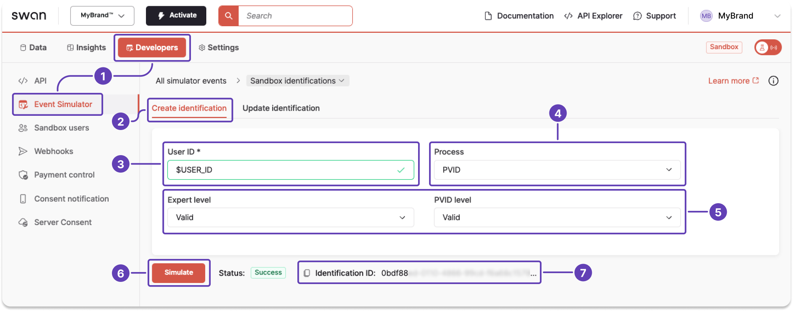
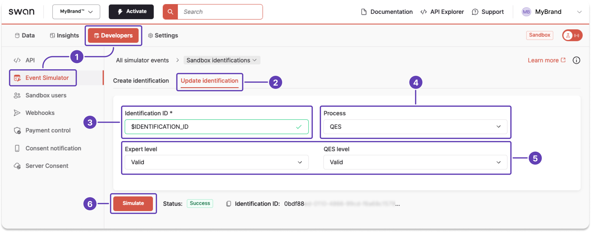

# Sandbox: Identifications

:::info Sandbox users
You can create, update, endorse, and delete Sandbox users with the Testing API.
Refer to the [example mutations](../../../developers/tools/sandbox-users.mdx#examples) on the **Sandbox users** page.
You can only simulate an identification on [Sandbox users](../../../developers/tools/sandbox-users.mdx#overview) who are linked to your project.
:::

## Simulate creating an identification {#simulate-create}

:::tip Prerequisites
Make sure you understand [identification levels and processes](./index.mdx#levels-processes).
:::

1. On your Dashboard, go to **Developers** > **Event Simulator**.
1. Open **Sandbox identifications**, then go to the **Create identification** tab.
1. Enter the **User ID**.
1. From the dropdown, choose the **identification process** you'd like to create.
    - Notice if more level dropdowns appear.
1. Choose the **level** for each process fulfilled by this identification.
    - Reminder: Identification processes can fulfill requirements for multiple levels.
    - Choose `Valid` to complete the identification. Choose a different status for testing purposes.
1. Click **Simulate**.
1. The simulator returns the identification ID.

## Simulate updating an identification {#simulate-update}

:::tip Prerequisites
Make sure you understand [identification levels and processes](./index.mdx#levels-processes).
:::
You can only update your own user's identification level in the Sandbox. Simulating a change to another user's identification level will be rejected.

1. On your Dashboard, go to **Developers** > **Event Simulator**.
1. Open **Sandbox identifications**, then go to the **Update identification** tab.
1. Enter the **Identification ID**.
1. From the dropdown, choose the **identification process** you'd like to create.
    - Notice if more level dropdowns appear.
1. Choose the **level** for each process fulfilled by this identification.
    - Reminder: Identification processes can fulfill requirements for multiple levels.
    - Choose `Valid` to complete the identification. Choose a different status for testing purposes.
1. Click **Simulate**.

