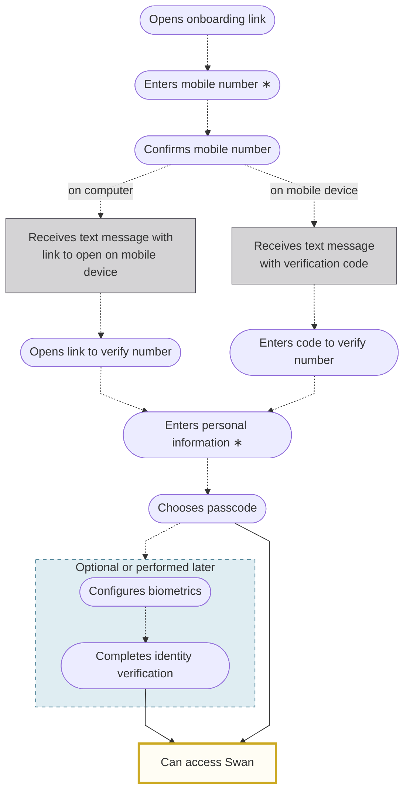

# Users overview

A **Swan user** is an actual person identified within Swan by their mobile number.

Using mobile phone numbers to identify users greatly simplifies their experience: users only need to know their mobile number to log into Swan, and occasionally their chosen 6-digit passcode.

:::info Sandbox users
When testing your integration, you'll need [Sandbox users](../../developers/tools/sandbox-users.mdx).
Sandbox users make it possible to simulate the different situations you may encounter with your real users in your Live environment.
:::

## Authentication {#authentication}

When a user wants to access their data or make transactions through your service with Swan's API, they must be [authenticated](../../developers/using-api/authentication/index.mdx).
This includes when they log into their Web Banking app, whether it's [Swan's open source](https://swan-io.github.io/swan-partner-frontend/getting-started/) version or your own custom integration.

## Logging in {#login}

After an initial login that requires more steps, explained in the [first login section](#first-login), logging into Swan is quick.

Your user **re-enters their mobile number** (every time, for security reasons), then either completes **biometric** authentication or enters the 6-digit **passcode** they chose during their first login.

Whether **biometrics function correctly** depends on your user's device.
If your user configured biometrics and is logging in (or consenting to a sensitive operation) from that same device, biometrics should work as expected.
However, if they access Swan from a new mobile device, they must enter their passcode.
Then, if desired, they can configure biometrics on the new device.

Additionally, biometrics might be **deactivated** if Swan's API detects that the mobile device's **operating system isn't up to date**.
In this case, the user enters their passcode to authenticate.
Before trying to reconfigure biometrics, they need to update the software on their mobile device.

### First login {#first-login}

Users need to complete their initial login during the onboarding process.

To log in for the first time, your user opens their onboarding link, then:

1. Enters their mobile number.
    - ∗ If you include their number when creating their onboarding link, they won't need to enter it again.
1. Confirms their mobile number, after which they continue the identity verification process on their mobile device. How they confirm this step depends on whether they opened the onboarding link from a computer or their mobile device:
    - **Computer**: Swan sends your user a text message with a link to open on their mobile device.
    - **Mobile device**: Swan sends your user a text message with a verification code. 
1. Enters their personal information, including their name and birthdate.
    - ∗ If you include this information when creating their onboarding link, they won't need to enter it again.
1. Selects a 6-digit passcode. They need to remember their passcode; Swan can request it anytime the user needs to consent to a sensitive operation.
1. Sets up biometrics, if desired and available on their mobile device. Biometrics typically include face or fingerprint authentication.
1. Completes [identity verification](./verification/index.mdx). This step can be performed later, though it's recommended to complete it as soon as possible.

After completing their first login, your user can start using Swan.

- If you're using Swan's provided **Web Banking** interface, Swan redirects your user to the interface automatically.
- If you're using a **custom API integration** or a customization of Swan's **open source frontend**, your user is redirected to the `redirectUrl` you supplied when creating their onboarding link.
Make sure to declare your `redirectUrl` on your **Dashboard** > **Developers** > **Redirect URIs**; otherwise, the redirection fails.

## Webhooks {#webhooks}

There are two webhooks related to the `users` query:

- `User.Joined`: webhook event when a user joins a project
- `User.Updated`: webhook event when there is an update to the user

Use these webhooks to receive notifications about your user's progress during the identity verification process, including updates such as a changed phone number.

`User.Joined` and `User.Updated` are different from other Swan webhooks: you **can't** query by the `userId`.
If you want information about a `userId`, [impersonate the user](../../developers/using-api/authentication/guide-impersonate.mdx) with a project access token instead.

## Guides {#guides}

- [Get a list of users](./overview/guide-get-list.mdx)
- [Get information about multiple users](./overview/guide-get-info-multiple.mdx)
- [Get information about a single user](./overview/guide-get-info-one.mdx)