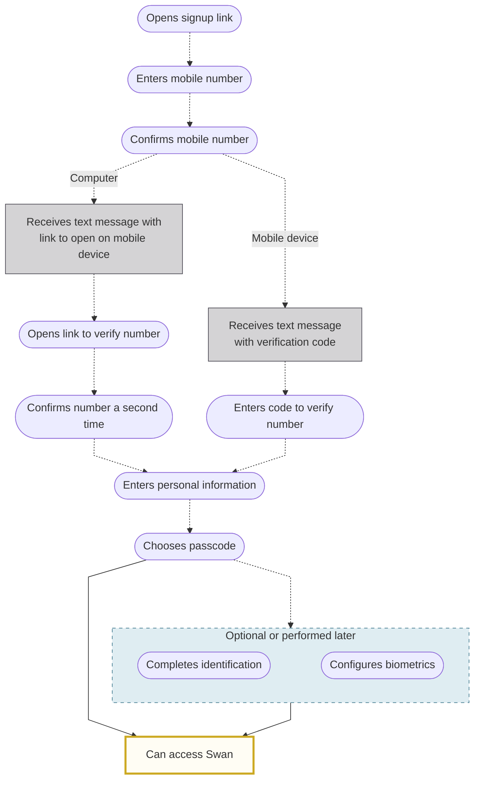

# Users overview

A **Swan user** is an actual person identified within Swan by their mobile phone number.
Swan users are managed **globally**, not project-by-project.
Therefore, users can **log into multiple projects** with the **same phone number**.

## Authentication {#authentication}

When a user wants to access their data or make transactions through your service with Swan's API, they must be [authenticated](../../developers/using-api/authentication/index.mdx).
This includes when they log into their Web Banking app, whether it's [Swan's open source](https://swan-io.github.io/swan-partner-frontend/getting-started/) version or your own custom integration.

## Phone numbers {#phone-numbers}

Using mobile phone numbers to identify users greatly simplifies their experience: users only need to know their mobile number to log into Swan, and occasionally their [chosen 6-digit passcode](#signup).
Their passcode is linked to their mobile phone number and is the same for all projects in both the Sandbox and Live environments.

Note that if your users get a **new phone number**, they should change their number with Swan.
They **shouldn't sign up again** with a new link, which would create a new Swan user.

If a user's mobile phone number previously belonged to someone else, and the number's former owner had a Swan account, **that user must be deactivated** before the new user can sign up with the phone number.

:::info Sandbox users
When testing your integration, you'll need [Sandbox users](../../developers/tools/sandbox-users.mdx).
Sandbox users make it possible to simulate the different situations you may encounter with your real users in your Live environment, as long as they're logging in with the **same phone number**.
:::

## Signing up {#signup}

Users sign up for Swan the first time their go through an authentication link.
This typically occurs when they're invited to become an [account member](../accounts/memberships/index.mdx) or during the [onboarding process](../onboarding/index.mdx).

Your user:

1. Opens their signup link.
1. Enters their **mobile number**.
    - If you include their number when creating their signup link, they won't need to enter it again.
1. Confirms their mobile number, after which they **continue the signup process** on their mobile device. How they confirm this step depends on whether they opened the signup link from a computer or their mobile device:
    - **Computer**: Swan sends your user a text message with a link to open on their mobile device.
    - **Mobile device**: Swan sends your user a text message with a verification code. 
1. Enters their **personal information**, including their name and birthdate. This information **must match** the information that appears on their **identity documents**.
    - If you include this information when creating their signup link, they won't need to enter it again.
1. Selects a **6-digit passcode**. They need to remember their passcode; Swan can request it anytime the user needs to consent to a sensitive operation.
1. Completes [**identification**](./identifications/index.mdx), where Swan verifies their identity. This step can be performed later, though it's recommended to complete it as soon as possible. If you're using the API, you're responsible for triggering this step.
1. Sets up **biometrics**, if desired and available on their mobile device. Biometrics typically include face or fingerprint authentication.

After signing up, your user can **start using Swan**.

- If you're using Swan's provided **Web Banking** interface, Swan redirects your user to the interface automatically.
- If you're using a **custom API integration** or a customization of Swan's **open source frontend**, your user is redirected to the `redirectUrl` you supplied when creating their signup link.
Make sure to declare your `redirectUrl` on your **Dashboard** > **Developers** > **Redirect URIs**; otherwise, the redirection fails.

  
End-user perspective of signing up for Swan

  

    <iframe src="https://www.figma.com/embed?embed_host=share&url=https%3A%2F%2Fwww.figma.com%2Ffile%2F7K15ufXZK7Zgan770kkTmq%2FUser-flow-diagrams%3Ftype%3Ddesign%26node-id%3D1%253A947%26mode%3Ddesign%26t%3DoGQbGo0SuPiYeJMG-1" allowFullScreen style={{width: "100%", height: 400}}></iframe>
  

## Logging in {#login}

After [signing up](#signup), logging into Swan is quick.

Your user **re-enters their mobile number** (every time, for security reasons), then either completes **biometric** authentication or enters the 6-digit **passcode** they chose when signing up.

Whether **biometrics function correctly** depends on your user's device.
If your user configured biometrics and is logging in (or consenting to a sensitive operation) from that same device, biometrics should work as expected.
However, if they access Swan from a new mobile device, they must enter their passcode.
Then, if desired, they can configure biometrics on the new device.

Additionally, biometrics might be **deactivated** if Swan's API detects that the mobile device's **operating system isn't up to date**.
In this case, the user enters their passcode to authenticate.
Before trying to reconfigure biometrics, they need to update the software on their mobile device.

  
End-user perspective of logging into Swan

  

    <iframe src="https://www.figma.com/embed?embed_host=share&url=https%3A%2F%2Fwww.figma.com%2Ffile%2F7K15ufXZK7Zgan770kkTmq%2FUser-flow-diagrams%3Ftype%3Ddesign%26node-id%3D1%253A2069%26mode%3Ddesign%26t%3DoGQbGo0SuPiYeJMG-1" allowFullScreen style={{width: "100%", height: 400}}></iframe>
  

  
End-user perspective of resetting their passcode

  

    <iframe src="https://www.figma.com/embed?embed_host=share&url=https%3A%2F%2Fwww.figma.com%2Ffile%2F7K15ufXZK7Zgan770kkTmq%2FUser-flow-diagrams%3Ftype%3Ddesign%26node-id%3D526%253A3656%26mode%3Ddesign%26t%3DoGQbGo0SuPiYeJMG-1" allowFullScreen style={{width: "100%", height: 400}}></iframe>
  

## User deactivation {#deactivate}

In certain circumstances, you might want to deactivate a user.
When a user is deactivated successfully, the **[phone number](#phone-numbers) associated with their Swan user object can be used for a new user**.

All of the following conditions must be met:

import DeactivateRequirements from './overview/_deactivate-reqs.mdx';

<DeactivateRequirements />

If all conditions are met, the user can be deactivated.
When a user is deactivated, all user access tokens and their associated refresh tokens associated with the deactivated user are revoked can no longer be used.

If conditions aren't met, there are three possible rejection reasons:

1. `UserCannotBeDeactivatedRejection`: the explained conditions aren't met.
1. `UserAlreadyDeactivatedRejection`: the user associated with this user ID was already deactivated.
1. `UserNotFoundRejection`: the user associated with this user ID wasn't found in the system.

Learn how to [deactivate a user with the API](./overview/guide-deactivate.mdx).
You can also send a request to Swan Support through your Dashboard or with an email to support@swan.io.

:::note Webhook
To get a notification when a user is deactivated, subscribe to the `User.Deactivated` [webhook](../../developers/using-api/webhooks.mdx).
:::

## Guides {#guides}

- [Get a list of users](./overview/guide-get-list.mdx)
- [Get information about multiple users](./overview/guide-get-info-multiple.mdx)
- [Get information about a single user](./overview/guide-get-info-one.mdx)
- [Deactivate a user](./overview/guide-deactivate.mdx)