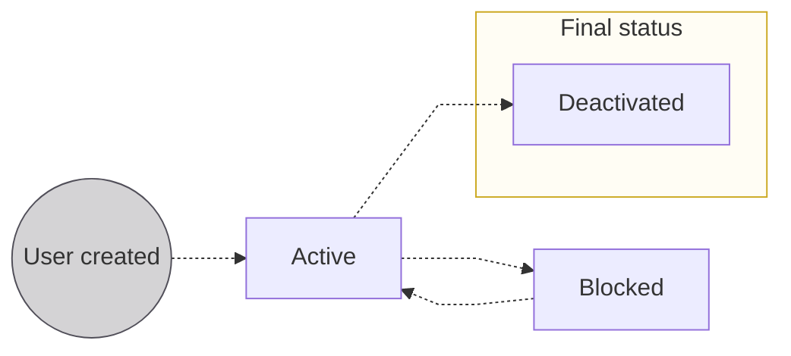

# Users overview

A **Swan user** is an actual person identified within Swan by their mobile phone number.
Swan users are managed **globally**, not project-by-project.
Therefore, users can **log into multiple projects** with the **same phone number**.

## Authentication {#authentication}

When a user wants to access their data or make transactions through your service with Swan's API, they must be [authenticated](../../developers/using-api/authentication/index.mdx).
This includes when they log into their Web Banking app, whether it's [Swan's open source](https://swan-io.github.io/swan-partner-frontend/getting-started/) version or your own custom integration.

## Phone numbers {#phone-numbers}

Using mobile phone numbers to identify users greatly simplifies their experience: users only need to know their mobile number to log into Swan, and occasionally their [chosen 6-digit passcode](#signup).
Their passcode is linked to their mobile phone number and is the same for all projects in both the Sandbox and Live environments.

Note that if your users get a new phone number, they should change their number with Swan.
They can **update their phone number independently** by tapping _New phone number? Update it_ at the start of any login or consent flow, then follow the prompts.
Users shouldn't sign up again with a new link, which would create a new Swan user.

If a user's mobile phone number previously belonged to someone else, and the number's former owner had a Swan account, **that user must be deactivated** before the new user can sign up with the phone number.

:::info Sandbox users
When testing your integration, you'll need [Sandbox users](../../developers/tools/sandbox-users.mdx).
Sandbox users make it possible to simulate the different situations you may encounter with your real users in your Live environment. Sandbox and Live users share the **same phone number**.
:::

## Signing up {#signup}

Users sign up for Swan the first time they go through an authentication link.
This typically occurs when they're invited to become an [account member](../accounts/memberships/index.mdx) or during the [account onboarding process](../onboarding/index.mdx).

Your user:

1. Opens their sign-up link.
1. **Enters their phone number**.
    - If you include their number when [creating their sign-up link](../../developers/using-api/authentication/guide-get-token-user.mdx#url-parameters-optional), they won't need to enter it again.
1. **Confirms their phone number**. How they confirm depends on whether they opened the sign-up link from a computer or their mobile device:
    1. **Computer**: Swan sends your user a text message with a verification code. The user enters this code on their computer to confirm their phone number.
    1. **Mobile device**: Swan sends your user a text message with a verification code.
1. **Enters their personal information**: first name, last name, and birthdate. This information must match the information that appears on their identity document.
    - The user skips this step if you included this information when [creating their sign-up link](../../developers/using-api/authentication/guide-get-token-user.mdx#url-parameters-optional).
1. **Sets a 6-digit passcode**. Users must remember their passcode. Swan can request it anytime the user needs to consent to a sensitive operation.
1. **Completes email verification** if included in the OAuth URL.
    - This step only appears if email verification was configured in the sign-up link.

:::note Identification
- If a user **isn't required** to complete identification, they can access Swan after setting their passcode.
- If a user **is required** to complete identification, they continue with steps 7-12.
:::

7. Enters their **birth information**: birth city, postal code, country, and nationality.
    - If you include this information when [creating their sign-up link](../../developers/using-api/authentication/guide-get-token-user.mdx#url-parameters-optional), they won't need to enter it again.
1. Enters their **residency information**. Swan only requests the information required for the relevant [identification process](./identifications/index.mdx#levels-processes) (to be completed in step 9).
    - `QES` process: residency address, city, country, and postal code.
    - `PVID` or `Expert` process: residency country only.
    - If you include this information when [creating their sign-up link](../../developers/using-api/authentication/guide-get-token-user.mdx#url-parameters-optional), they won't need to enter it again.
1. **Reviews and confirms all provided information**: personal, birth, and residency. Users can modify their information before confirming.
1. [**Completes identification**](./identifications/index.mdx), where Swan verifies their identity. This step **can be performed later**, though it's recommended to complete it as soon as possible. When using the API, you must trigger this step.
1. *(Optional)* **Sets up biometrics**, if desired and available on their mobile device. Biometrics typically include face or fingerprint authentication.
1. Gets redirected to your redirect URL.

:::note Identification rejection
If a user's identification fails, they receive a text message after completing sign-up with the **reason for the failure**. They must follow the link provided to retry. 

Share the support article on [Identification rejection reasons and solutions](https://support.swan.io/hc/en-150/articles/16421416513693-Identification-rejection-reasons-and-solutions) to help your users troubleshoot the identification process.
:::

### Sign-up diagram {#signup-diagram}

The following diagram illustrates the steps to sign up for Swan.

```mermaid
%%{ init: { 'flowchart': { 'curve': 'linear' } } }%%
flowchart TB
    MobileEntry([User sign-up started on mobile with<br/>an OAuth 2.0 link]) -.-> EntersMobileNumber([Enters mobile number])
    ComputerEntry([User sign-up started on computer with<br/>an OAuth 2.0 link]) -.-> EntersMobileNumber

    EntersMobileNumber -- User on mobile --> ConfirmsMobileNumberMobile([Confirms mobile number])
    EntersMobileNumber -- User on computer --> ReceivesOTP([Receives verification code in text message])

    ConfirmsMobileNumberMobile --> ReceivesCode([Receives verification code in text message])
    ReceivesCode --> EntersCode([Enters verification code])
    EntersCode --> QueryParams{Are query parameters filled?}
    
    ReceivesOTP --> EntersOTP([Enters verification code on computer])
    EntersOTP --> QueryParams

    QueryParams -- No --> EntersPI([Enters personal information])
    QueryParams -- Yes --> UserStartedComputer{User started sign-up on computer?}

    EntersPI --> UserStartedComputer
    UserStartedComputer -- Yes --> ConfirmsNumber([Confirms number on computer])
    ConfirmsNumber --> ChoosesPasscode([Chooses 6-digit passcode])
    UserStartedComputer -- No --> ChoosesPasscode

    ChoosesPasscode --> ConfirmsPasscode([Confirms 6-digit passcode])

    ConfirmsPasscode --> EmailVerificationIncluded{Email verification included in OAuth URL?}
    EmailVerificationIncluded -- Yes --> EmailVerificationFlow([Email verification flow])
    EmailVerificationIncluded -- No --> EntersBirthInfo

    EmailVerificationFlow --> EntersBirthInfo([Enters birth information])
    EntersBirthInfo --> EntersResidencyInfo([Enters residency information])
    EntersResidencyInfo --> ConfirmsInfo([Confirms personal, birth,<br/>and residency information])

    ConfirmsInfo --> O

    subgraph O[Optional or performed later]
        direction LR
        IV([Completes identification]) ~~~ B([Configures biometrics])
    end

    O --> S[Can access Swan]

    style S fill:#fffdf4,stroke:#cca922,stroke-width:3px
    style O fill:#E6F3F8,stroke:#4D8296,stroke-dasharray: 5 5
    style IV fill:#E6E6FA,stroke:#6A5ACD
    style B fill:#E6E6FA,stroke:#6A5ACD
    style EntersMobileNumber fill:#D4D3D5,stroke:#514F59
    style ConfirmsMobileNumberMobile fill:#D4D3D5,stroke:#514F59
    style ReceivesCode fill:#D4D3D5,stroke:#514F59
    style EntersCode fill:#D4D3D5,stroke:#514F59
    style ReceivesOTP fill:#D4D3D5,stroke:#514F59
    style EntersOTP fill:#D4D3D5,stroke:#514F59
    style ConfirmsNumber fill:#D4D3D5,stroke:#514F59
    style EntersPI fill:#D4D3D5,stroke:#514F59
    style ChoosesPasscode fill:#D4D3D5,stroke:#514F59
    style ConfirmsPasscode fill:#D4D3D5,stroke:#514F59
    style EmailVerificationFlow fill:#D4D3D5,stroke:#514F59
    style EntersBirthInfo fill:#D4D3D5,stroke:#514F59
    style EntersResidencyInfo fill:#D4D3D5,stroke:#514F59
    style ConfirmsInfo fill:#D4D3D5,stroke:#514F59
    style UserStartedComputer fill:#E6E6FA,stroke:#6A5ACD
    style QueryParams fill:#E6E6FA,stroke:#6A5ACD
```

  
End-user perspective of signing up

  

    <iframe 
  src="https://www.figma.com/embed?embed_host=share&url=https%3A%2F%2Fwww.figma.com%2Ffile%2F7K15ufXZK7Zgan770kkTmq%2FUser-flow-diagrams%3Ftype%3Ddesign%26node-id%3D110018-2506%26mode%3Ddesign" 
  allowfullscreen style={{width: "100%", height: 400}}>
</iframe>
  

### Accessing accounts {#signup-access}

After signing up, your user can start using Swan.
How they get to their account depends on your [integration](../get-started/choose-integration.mdx):

| Integration | Access |
| --- | --- |
| No-code Web Banking | Swan redirects your user to the interface automatically. |
| Full API *or* Customized open source frontend | Your user is redirected to the `redirectUrl` you supplied when [creating their sign-up link](../../developers/using-api/authentication/guide-get-token-user.mdx#url-parameters-optional). Make sure to declare your `redirectUrl` on your **Dashboard** > **Developers** > **Redirect URIs**. Otherwise, the redirection fails. |

## Logging in {#login}

After [signing up](#signup), logging into Swan is quick.

Your user **re-enters their mobile number** (every time, for security reasons), then authenticates.
How authentication works depends on the device:

- **Computer**: Swan sends your user a text message with a verification code. The user enters this code on their computer, then enters the 6-digit **passcode** they chose when signing up.
- **Mobile device**: Swan sends your user a text message with a verification code. The user enters this code, then either completes **biometric** authentication or enters their 6-digit **passcode**.

:::info Biometrics
Biometrics are only available on mobile devices.

Whether **biometrics function correctly** depends on your user's device.
If your user configured biometrics and is logging in (or consenting to a sensitive operation) from that same device, biometrics should work as expected.
However, if they access Swan from a new mobile device, they must enter their passcode.
Then, if desired, they can configure biometrics on the new device.

Additionally, biometrics might be **deactivated** if Swan's API detects that the mobile device's **operating system isn't up to date**.
In this case, the user enters their passcode to authenticate.
Before trying to reconfigure biometrics, they need to update the software on their mobile device.
:::

  
End-user perspective of logging into Swan

  

    <iframe src="https://www.figma.com/embed?embed_host=share&url=https%3A%2F%2Fwww.figma.com%2Ffile%2F7K15ufXZK7Zgan770kkTmq%2FUser-flow-diagrams%3Ftype%3Ddesign%26node-id%3D1%253A2069%26mode%3Ddesign%26t%3DoGQbGo0SuPiYeJMG-1" allowFullScreen style={{width: "100%", height: 400}}></iframe>
  

  
End-user perspective of resetting their passcode

  

    <iframe src="https://www.figma.com/embed?embed_host=share&url=https%3A%2F%2Fwww.figma.com%2Ffile%2F7K15ufXZK7Zgan770kkTmq%2FUser-flow-diagrams%3Ftype%3Ddesign%26node-id%3D526%253A3656%26mode%3Ddesign%26t%3DoGQbGo0SuPiYeJMG-1" allowFullScreen style={{width: "100%", height: 400}}></iframe>
  

## User deactivation {#deactivate}

In certain circumstances, you might want to deactivate a user.
When a user is deactivated successfully, the **[phone number](#phone-numbers) associated with their Swan user object can be used for a new user**.

All of the following conditions must be met:

import DeactivateRequirements from './overview/_deactivate-reqs.mdx';

<DeactivateRequirements />

If all conditions are met, the user can be deactivated.
When a user is deactivated, all user access tokens and refresh tokens associated with the deactivated user are revoked and can no longer be used.

If conditions aren't met, there are three possible rejection reasons:

1. `UserCannotBeDeactivatedRejection`: the explained conditions aren't met.
1. `UserAlreadyDeactivatedRejection`: the user associated with this user ID was already deactivated.
1. `UserNotFoundRejection`: the user associated with this user ID wasn't found in the system.

Learn how to [deactivate a user with the API](./overview/guide-deactivate.mdx).
You can also submit a request to [Swan Support](https://partner-support.swan.io/hc/en-gb/requests).

:::note Webhook
To get a notification when a user is deactivated, subscribe to the `User.Deactivated` [webhook](../../developers/using-api/webhooks.mdx).
:::

## Statuses {#statuses}

| Status | Explanation |
|---|---|
| `Active` | Users are `Active` as soon as they're created. They can access and use Swan. |
| `Blocked` | Status assigned by Swan for security reasons.  `Blocked` users can't access or use Swan services. The phone number remains attached to the user and can't be used for someone else. In certain edge cases, `Blocked` users can return to `Active` after careful review. |
| `Deactivated` | You can deactivate users [with the API](./overview/guide-deactivate.mdx), and Swan can also assign this status.  Deactivated users can't access Swan or use Swan services. Phone numbers attached to `Deactivated` users can be assigned to someone else. |

:::caution Access tokens
[User access tokens](../../developers/using-api/authentication/index.mdx#tokens-user) associated with `Blocked` or `Deactivated` users are revoked as soon as the status changes from `Active`.
You can no longer use the API on their behalf.
You also can't use a [project access token to impersonate](../../developers/using-api/authentication/index.mdx#tokens-project) `Blocked` or `Deactivated` users. 
:::

## Guides {#guides}

- [Get a list of users](./overview/guide-get-list.mdx)
- [Get information about multiple users](./overview/guide-get-info-multiple.mdx)
- [Get information about a single user](./overview/guide-get-info-one.mdx)
- [Export user data](./overview/guide-export.mdx)
- [Deactivate a user](./overview/guide-deactivate.mdx)