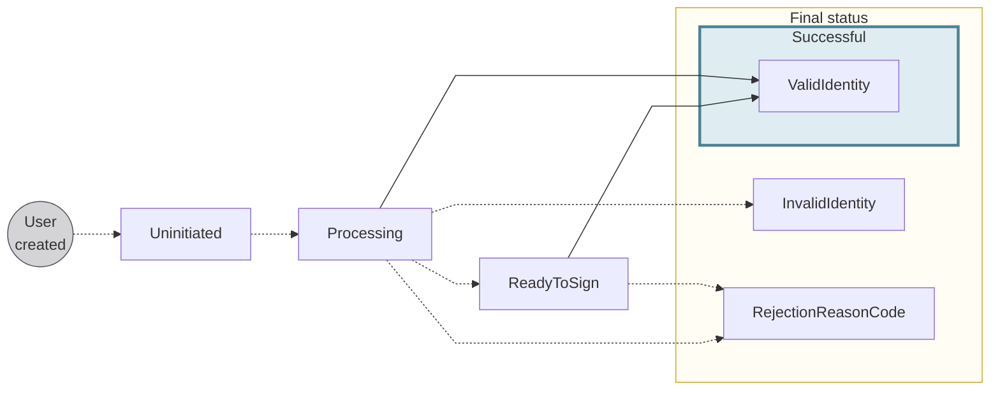

# Identity verification

Swan users need to prove their identities at key points during their user journey.
To facilitate the process, Swan provides secure identity verification options using live video and artificial intelligence.

:::caution Removing identity verification
For users with non-sensitive access to accounts, defined by their [account membership permissions](../../accounts/memberships/index.mdx#remove-verification), identity verification can be removed in some B2B situations.
:::

## Overview {#overview}

Users can complete identity verification at any time—24 hours a day, 7 days a week.
After starting the identity verification process, users have 10 minutes to finish before the process times out.

Identity verification validates the following elements:

1. Is the identity document authentic?
1. Is this person real?
1. Does the face presented actually match the identity document?

Note that users must log into Swan during the identity verification process.

:::info Verifications
**Identity verification** is performed on the `user` object to verify that the user is a real person compliant with all of Swan's requirements.

[**Account holder verification**](../../onboarding/account-holders/index.mdx#verifying-account-holders) only begins after identity verification is complete.
In the form of KYC or KYB, account holder verification is performed on the `accountHolder` object because the account holder is the owner of the Swan account.
:::

### Encourage identity verification {#encourage}

Your users have the option to complete identity verification during their [first login](../index.mdx#first-login), which is part of the onboarding process.
Swan also sends your users a text message with a link they can use anytime.

If your users aren't completing identity verification despite these automated efforts, you can encourage them by sending them an authentication link:

1. Follow the [guide to get a user access token](../../../developers/using-api/authentication/guide-get-token-user.mdx#auth-code).
1. In step 2.1, add the `idverified` parameter to the `scope` (line 9; also includes `openid` and `offline`).

## Identification processes {#processes}

Swan offers three identification processes.
The process your users complete depends on your use case and location.

1. **Expert**
1. **QES**: Qualified Electronic Signature
1. **PVID**: Prestataires de vérification d'identité à distance
    - In English: *Remote Identity Verification Service Providers*
    - French IBANs only

Find the [list of identificationLevels](https://explorer.swan.io?query=cXVlcnkgTGlzdE9mTGV2ZWxzIHsKICB1c2VyIHsKICAgIGxhc3ROYW1lCiAgICBpZGVudGlmaWNhdGlvbkxldmVscyB7CiAgICAgIGV4cGVydAogICAgICBwdmlkCiAgICAgIHFlcwogICAgfQogICAgaWRlbnRpZmljYXRpb25TdGF0dXMKICAgIGlkVmVyaWZpZWQKICAgIGlkCiAgICBmaXJzdE5hbWUKICAgIGJpcnRoRGF0ZQogICAgYWxsRmlyc3ROYW1lcwogICAgbmF0aW9uYWxpdHlDQ0EzCiAgICBtb2JpbGVQaG9uZU51bWJlcgogIH0KfQo%3D&tab=api) is the `user` query.

### Expert {#expert}

Expert is the default identification process at Swan.
It can be used to verify an account holder's legal representative as well as every account membership with sensitive access to an account.
This requires a manual, asynchronous review by an expert.

To start an Expert identity verification, follow the [guide to get a user access token](../../../developers/using-api/authentication/guide-get-token-user.mdx#auth-code).
In step 2.1, set the optional parameter `identificationLevel` to `Expert`.

### QES {#qes}

Qualified Electronic Signature (QES) confirms who created an identity document, *and* that the document hasn't been altered since being signed.
If both elements are confirmed, QES validates the authenticity and integrity of the document.

Qualified electronic signatures are compliant with [EU Regulation No 910/2014](https://eur-lex.europa.eu/legal-content/EN/TXT/?uri=uriserv%3AOJ.L_.2014.257.01.0073.01.ENG) ([eIDAS Regulation](https://digital-strategy.ec.europa.eu/en/policies/eidas-regulation)) for electronic transactions within Europe.
Qualified electronic signatures are the digital equivalent to handwritten signatures.
QES predominantly verifies individual account holders and requires a manual, asynchronous identity review by an expert before starting the signature.

To start a QES identity verification, follow the [guide to get a user access token](../../../developers/using-api/authentication/guide-get-token-user.mdx#auth-code).
In step 2.1, set the optional parameter `identificationLevel` to `QES`.
After verification, the user's `identificationStatus` changes to `ReadyToSign`.
At this point, redirect your user to sign Swan's Terms and Conditions, still with the optional parameter `identificationLevel` set to `QES`.

#### First transfer {#qes-first-transfer}

QES first transfer info

### PVID {#pvid}

> French: *Prestataires de vérification d'identité à distance* 
> English: *Remote Identity Verification Service Providers*

PVID verifies a user's identity remotely using a mobile phone to capture and verify identity documents and facial recognition.
PVID is only valid for accounts with French IBANs.

Any individual opening an account with a French IBAN can use PVID to complete identification if you configure it that way.

To start a PVID identity verification, follow the [guide to get a user access token](../../../developers/using-api/authentication/guide-get-token-user.mdx#auth-code).
In step 2.1, set the optional parameter `identificationLevel` to `PVID`.

### Processes and levels {#process-vs-level}

Identification processes and levels have the **same names** within Swan's API.

The process depends on your use case and location.
Your required process might be able to be fulfilled by several levels.
For example, *both* the `Expert` and `PVID` **levels** meet the requirement for the `PVID` **process**.

| Process → ↓ Fulfilled by | `Expert` process | `PVID` process | `QES` process |
| :---: | :---: | :---: | :---: |
| `Expert` level | ✓ **Yes** | ✓ **Yes** | ✓ **Yes** |
| `PVID` level | ☒ No | ✓ **Yes** | ☒ No |
| `QES` level | ☒ No | ☒ No | ✓ **Yes** |

### Process recommendations {#processes-recommendations}

Accepted identification processes vary by country based on local regulations.
For each [account country](../../accounts/index.mdx#account-country) and type of account, Swan recommends a process and, if possible, offers other acceptable processes.

Refer to the following tables for recommendations for individual and company accounts.
The first process listed is in bold with a checkmark (✓), indicating it's the process Swan recommends.

| Account country | Individual accounts | Company accounts |
| --- | --- | --- |
| 🇫🇷 France | **✓ PVID** Expert + [first transfer](#qes-first-transfer) QES | **✓ Expert** QES PVID |
| 🇩🇪 Germany | **✓ QES** + [first transfer](#qes-first-transfer) | **✓ Expert** QES |
| 🇳🇱 Netherlands | **✓ Expert** QES PVID | **✓ Expert** QES PVID |
| 🇪🇸 Spain | **✓ Expert** QES PVID | **✓ Expert** QES PVID |

:::info Self-employed account holders
For users who are **self-employed** account holders, recommendations depend on their status.

- 🇫🇷 **France unregistered self-employed**: PVID, or Expert + [first transfer](#qes-first-transfer)
- 🇫🇷 **France registered self-employed**: Expert
- 🇩🇪 **Germany self-employed**: QES + [first transfer](#qes-first-transfer)
:::

## Identification statuses {#statuses}

| Transaction status | Explanation |
|---|---|
| `Uninitiated` | The user has been created with Swan, but the identity verification process hasn't started yet. |
| `Processing` | The identity verification process is in progress.  **Next steps**:<ul><li>If the user verifies their identity successful for Expert or PVID, the status changes to `ValidIdentity`</li><li>If the user verifies their identity successful for QES, the status changes to `ReadyToSign` and the user is prompted to provide an electronic signature to finalize their identity verification</li><li>If the identity verification is unsuccessful because their identity is flagged as invalid, the status changes to `InvalidIdentity`</li><li>If the identity verification is unsuccessful because of any of the rejection reasons listed in the next section, the status changes to the corresponding `RejectionReasonCode`</li></ul> |
| `ReadyToSign` | The user's identity was verified using the QES process, and the user now needs to sign electronically to finalize the process.  **Next steps**:<ul><li>If the user signs successfully, the status changes to `ValidIdentity`</li><li>If the user's signature isn't valid or isn't submitted, the status changes to the corresponding `RejectionReasonCode`</li></ul> |
| `ValidIdentity` | The user's identity is verified. They can continue to account holder verification if applicable. |
| `InvalidIdentity` | The user's identity is invalid. They can try again using the same level or a different level. |
| `RejectionReasonCode` | Identity verifications can be rejected for numerous reasons, detailed in the following section. When rejected, that verification attempt is final; the user must try again with a new identity verification instance. |

### Rejection reason codes {#tracking-reason-codes}

| Reason code | Explanation |
| ---- | ---- |
| `AbsentOrIncompleteFace` | The user's face must be fully present in the photo. |
| `AlteredDevice` | The device the user used was flagged as being technically modified (such as jailbreaking an iPhone). |
| `BadDocumentLighting` | The lighting on the actual document is insufficient, meaning it's either not bright enough or too bright, making information illegible. |
| `DamagedDocument` | The document is damaged in some way. It could be as minor as a bent corner. |
| `ExpiredDocument` | The expiry date of document has passed. |
| `FraudDetected` | There was an attempt to commit fraud detected. |
| `InadequateVideo` | The video quality isn't sufficient or video is missing required information. |
| `InsufficientApplicantLighting` | The lighting on the user's face is insufficient, meaning it's either not bright enough or too bright. |
| `InsufficientApplicantLiveness` | When completing challenges, the user must meet minimum movement requirements. |
| `InsufficientConnectionQuality` | The user's internet connection isn't strong enough to complete the identification process. |
| `InsufficientDocumentLiveness` | When completing challenges, the user must move their document enough to meet minimum movement requirements. |
| `InsufficientDocumentReadability` | The user's document is blurry or otherwise distorted. |
| `InsufficientFaceReadability` | The user's face is blurry or otherwise distorted. |
| `InsufficientVideoReadability` | The user's video is blurry or otherwise distorted. |
| `InternalError` | There was a technical error. Swan is unable to provide more precise information for this reason code; the user should try again. |
| `InvalidAddress` | The submitted address isn't valid or in an accepted format. |
| `InvalidOrMissingData` | The user's identification data is invalid or missing. |
| `InvoluntaryIdentification` | The user seems to be completing the identity verification against their will. |
| `MissingGeolocationData` | The user's geolocation data is required for this identification, but it isn't available. Often, they need to consent to share this data. |
| `NonMatchingIdentity` | The user's identity doesn't match the expected identity information based on submitted information. |
| `NonOriginalDocument` | The user submitted a duplicate of the identity document, whether digital or paper, instead of the original. |
| `SanctionsListHit` | The user appears on a sanctions list. |
| `SecondDocumentRequired` | The user must provide a second identity document. |
| `TechnicalSignatureError` | There was a technical error with the electronic signature process. The user should try again. |
| `TimeoutSignatureFlow` | The time to complete the electronic signature expired. The user should try again. |
| `UnacceptableDocument` | The document submitted by the user isn't on list of acceptable document types. |
| `UnderageApplicant` | The user is under the minimum required age. Swan account holders must be at least 18. |
| `NegativeNewsHit` | The user appears on an unacceptable news list. |

## Tracking identity verifications {#tracking}

You can access all identity verifications performed by users who are onboarding into your project with the `user` query, which allows you to:

- Follow identity verifications in **real time**.
- Access a detailed **list of reasons** identifications aren't accepted. The list can help you guide users so they can successfully verify their identity.

Refer to the guides in this section for full sample queries and payloads of the `user` query.

You can also use the Event Simulator (**Dashboard** > **Developers** > **Event Simulator** > **Sandbox users**) to test various combinations of statuses, identification levels, and rejection reason codes.

## Identity documents {#levels-documents}

Swan offers an identity document sharing feature, providing access to identity verification **document metadata** as well as the documents themselves.
Contact your dedicated SSAM to learn more.

## Guides 

- [Get a list of identifications](./guide-get-identifications.mdx)
- [Get a user's latest identification status](./guide-get-latest-id.mdx)