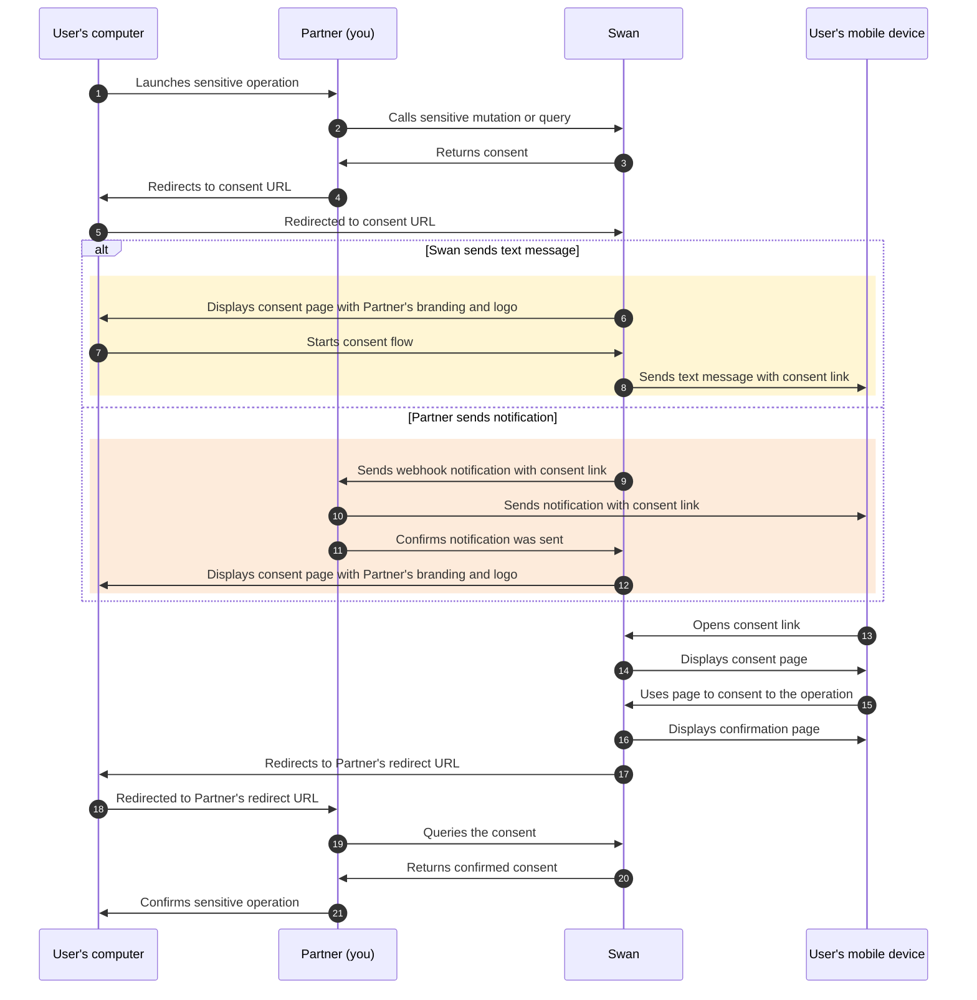
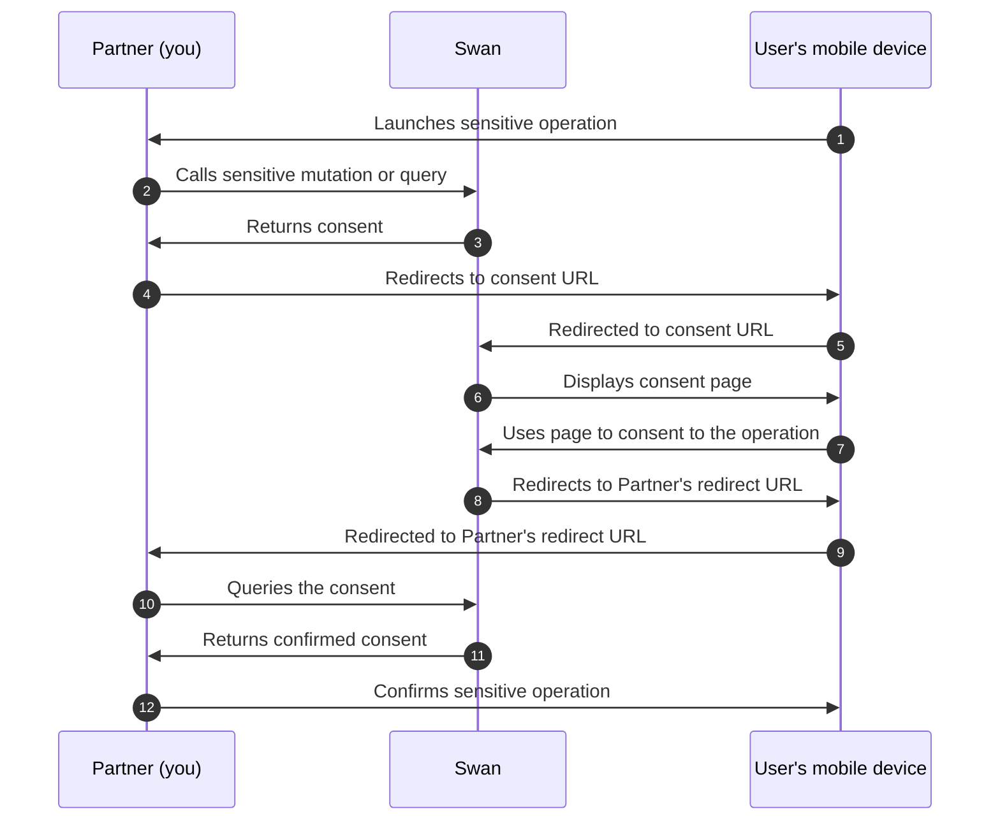

# Consent

<p className="ia-lede">Some operations at Swan are considered sensitive, and sensitive operations always require user consent.</p>

Consent is built into Swan's offer, meaning you don't handle it yourself.
In fact, you can't: it's part of Swan's [regulatory responsibility](/get-started/become-a-partner/licence-regulatory-status#license) to manage consent.
Additionally, **consent can't be deactivated**.

To initiate sensitive operations **using the API**, you need to authenticate with an access token.
You can use either a [user access token](/build/using-api/authentication#tokens-user) in the name of the user wanting to make the payment, or a [project access token](/build/using-api/authentication#tokens-project) impersonating that user.
Users must consent to granting a user access token.

Review the full [list of sensitive operations](/users/reference/sensitive-operations) in the reference section.

Consent requests move through a defined set of [consent statuses](./statuses.mdx).

## Strong Customer Authentication (SCA) {#sca}

To protect the user and comply with legal requirements, users can only provide consent through Strong Customer Authentication (SCA).

SCA is required by the EU Revised Directive on Payment Services (PSD2) for payment service providers within the European Economic Area.
The requirement mandates **multi-factor authentication** to increase the security of electronic payments.
All Swan consent processes use SCA.

:::note Delegating SCA
In some cases, Swan can delegate all or part of SCA to you.
If this could be helpful for your use case, please discuss delegating SCA with your PIM (Product Integration Manager).
:::

### SCA user experience {#sca-user}

Though there's much more happening technically, the user experience to consent to sensitive operations is straightforward and typically quick. 

1. The user **opens the consent URL**.
    1. **Computer**: They receive the consent link in a text message from Swan or a notification from you. The user opens the link and follows the instructions.
    1. **Mobile device**: They're redirected to the correct page.
1. If the user **doesn't receive a text message**, they can either request the text message be sent again or consent by scanning a QR code.
1. The user **verifies their identity** by entering their 6-digit passcode or using biometrics.
1. The user is then redirected to your predefined `redirectUrl`.

<details>
  <summary>Video completing Strong Customer Authentication on mobile</summary>
    <div>
        
    </div>
</details>

:::caution Text message and link validity
Text messages are valid for **15 minutes**, and consent links **time out 20 minutes after** being opened.
:::

In the [consent sequence diagrams](#consent-diagrams), this user experience occurs when the user opens the consent link and completes the consent request.
Look for the arrow description `Uses page to consent to the operation`.

## Multi-consents {#multi-consent}

Multi-consent allows you to group multiple consents for sensitive operations into a single consent, so your user can **consent to multiple operations at the same time**.
For example, your user could consent to adding a card, adding an account membership, and initiating a credit transfer, all at once.
Creating a multi-consent is an asynchronous operation, and you can group up to **100 child consents** into one multi-consent.

When the user consents to the multi-consent, they're informed their multi-consent is complete.
However, child consents aren't processed immediately: execution is asynchronous, and each child consent can still succeed or fail.
Refer to [consent statuses](./statuses.mdx) for how a multi-consent and its child consents resolve.

Since execution is asynchronous, consider subscribing to [consent webhooks](/build/using-api/webhooks#events-consent) to stay updated on the progress of each child consent.

Learn how to **create a multi-consent** in the [dedicated guide](/users/guides/consent/create-multiconsent).

## Notification preferences {#notifications}

You can specify how your user would like to receive consent notifications, referred to as their preferred channel.
Swan offers two possibilities:

1. Swan sends a text message to the user, which includes the SCA link the user needs to open on their mobile device.
1. You receive a notification, then you send the SCA link to your user. This is only possible if you have your own mobile app.

If you choose to receive the notification and send it to your user, you'll need to configure your notifications.
Learn how to **specify notification preferences** and **configure your own notifications** in the [dedicated guide](/users/guides/consent/configure-notifications).

:::info Web Banking interface
If you use Swan's Web Banking interface, Swan sends a text message to your users for one-time passwords, logins, and consents, regardless of preferred channel and notification configuration.
:::

## Consent sequence diagrams {#consent-diagrams}

### Diagram: Computer {#consent-diagrams-computer}

If your user is on a computer, their consent flow depends on your [notification settings](#notifications).
They'll either receive a **text message from Swan** (arrows 6-8) or a **notification from you** (arrows 9-12).

Online payments that require [3-D Secure consent](/payments/concepts/cards#3ds) guide users through a slightly different flow.



### Diagram: Mobile device {#consent-diagrams-mobile}

If the user is on their mobile device, they don't need a computer for the consent flow.



### Diagram: End-user perspective {#consent-diagrams-end-user}

<details>
  <summary>End-user perspective of consenting to add an account membership</summary>
  <div>
    <iframe src="https://www.figma.com/embed?embed_host=share&url=https%3A%2F%2Fwww.figma.com%2Ffile%2F7K15ufXZK7Zgan770kkTmq%2FUser-flow-diagrams%3Ftype%3Ddesign%26node-id%3D1%253A563%26mode%3Ddesign%26t%3DoGQbGo0SuPiYeJMG-1" allowFullScreen style={{width: "100%", height: 400}}></iframe>
  </div>
</details>

## In this section

```flowmap
{
  "mode": "pathway",
  "items": [
    { "title": "Server-to-server consent", "to": "/users/concepts/consent/server-to-server" },
    { "title": "Consent statuses", "to": "/users/concepts/consent/statuses" }
  ]
}
```
