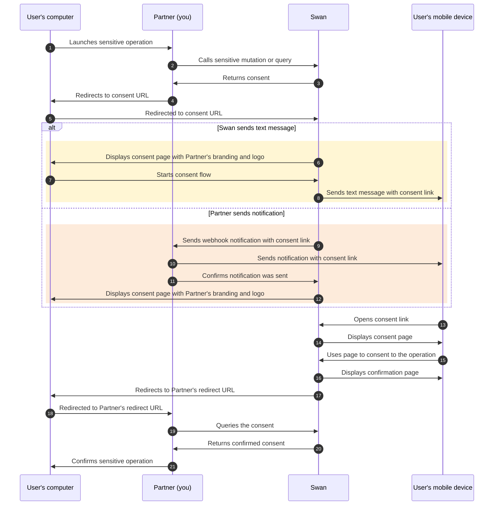
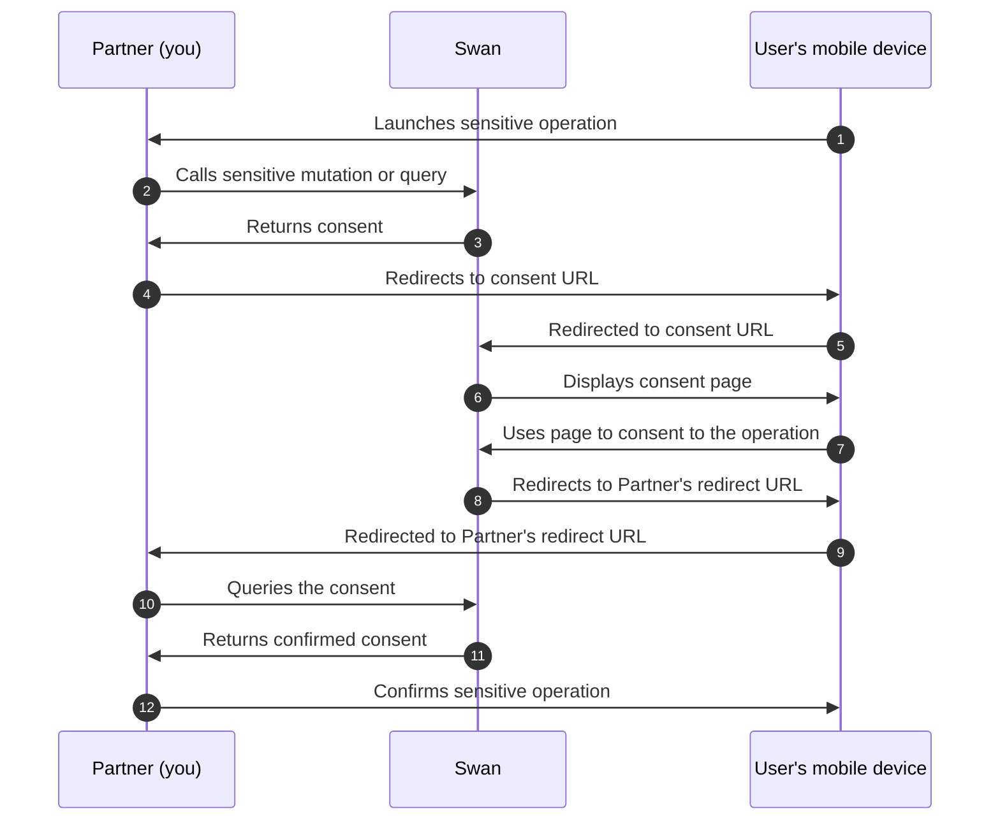

# Strong Customer Authentication

To protect the user and comply with legal requirements, users can only provide consent through Strong Customer Authentication (SCA).

SCA is required by the EU Revised Directive on Payment Services (PSD2) for payment service providers within the European Economic Area.
The requirement mandates **multi-factor authentication** to increase the security of electronic payments.
All Swan consent processes use SCA.

:::note Delegating SCA
In some cases, Swan can delegate all or part of SCA to you.
If this could be helpful for your use case, please discuss delegating SCA with your PIM (Product Integration Manager).
:::

## SCA user experience {#sca-user}

Though there's much more happening technically, the user experience to consent to sensitive operations is straightforward and typically quick. 

1. The user **opens the consent URL**.
    1. **Computer**: They receive the consent link in a text message from Swan or a notification from you. The user opens the link and follows the instructions.
    1. **Mobile device**: They're redirected to the correct page.
1. If the user **doesn't receive a text message**, they can either request the text message be sent again or consent by scanning a QR code.
1. The user **verifies their identity** by entering their 6-digit passcode or using biometrics.
1. The user is then redirected to your predefined `redirectUrl`.

  
Video completing Strong Customer Authentication on mobile

    

        
    

:::caution Text message and link validity
Text messages are valid for **15 minutes**, and consent links **time out 20 minutes after** being opened.
:::

In the [consent sequence diagrams](#consent-diagrams), this user experience occurs when the user opens the consent link and completes the consent request.
Look for the arrow description `Uses page to consent to the operation`.

## Consent sequence diagrams {#consent-diagrams}

### Diagram: Computer {#consent-diagrams-computer}

If your user is on a computer, their consent flow depends on your [notification settings](/users/concepts/consent#notifications).
They'll either receive a **text message from Swan** (arrows 6-8) or a **notification from you** (arrows 9-12).

Online payments that require [3-D Secure consent](/payments/concepts/cards#3ds) guide users through a slightly different flow.

### Diagram: Mobile device {#consent-diagrams-mobile}

If the user is on their mobile device, they don't need a computer for the consent flow.

### Diagram: End-user perspective {#consent-diagrams-end-user}

  
End-user perspective of consenting to add an account membership

  

    <iframe src="https://www.figma.com/embed?embed_host=share&url=https%3A%2F%2Fwww.figma.com%2Ffile%2F7K15ufXZK7Zgan770kkTmq%2FUser-flow-diagrams%3Ftype%3Ddesign%26node-id%3D1%253A563%26mode%3Ddesign%26t%3DoGQbGo0SuPiYeJMG-1" allowFullScreen style={{width: "100%", height: 400}}></iframe>
  

