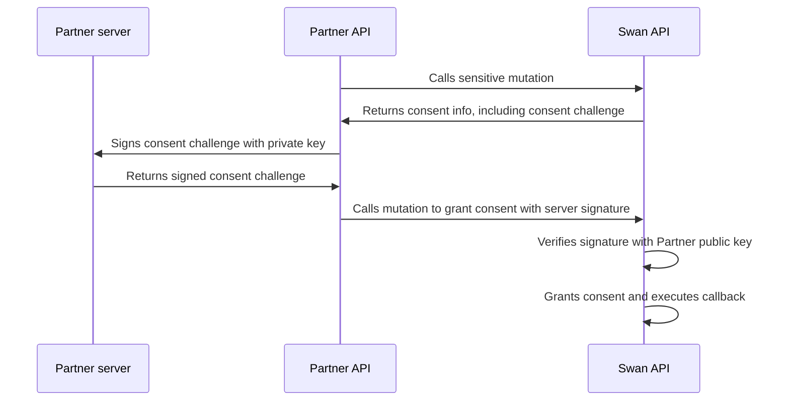

# Server-to-server consent

Server-to-server (S2S) consent bypasses direct user intervention, making bulk actions that your integrations might require easier to execute.

If you have thousands of operations waiting for consent, requiring consent directly from the user could become a blocker.
For example, you might consider using server-to-server consent to generate single-use virtual cards to pay merchants, perform batch payments, and refund transfers.

Strong Customer Authentication normally requires human interaction, but Swan makes an exception for your own accounts: you can approve sensitive operations with S2S consent.
Your implementation requires Swan's approval.

Many sensitive operations are eligible for server-to-server consent.
Some operations allow you to view highly sensitive information and, therefore, aren't eligible for server-to-server consent.
Review the [list of sensitive operations](/users/reference/sensitive-operations) to know which operations are eligible for server-to-server consent, marked with the symbol ⮂.

Learn how to **implement server-to-server consent** in the [dedicated guide](/users/guides/consent/implement-s2s).

## Key cryptography {#s2s-crypto}

Server-to-server consent relies on a pair of keys, public and private.
Swan only accepts keys that use the following algorithm:

- ECDSA with a reputed strong curve (such as p-256)
- Exported in JWK format

You'll install the public key on your Dashboard, and it will be used to verify the server signature for all S2S operations.
You're required to keep the corresponding private key secure on your side.

:::caution Replace keys
Swan strongly advises you to replace your key pair every two years.
:::

## Role of projects and legal representatives {#s2s-projects}

For security and regulatory purposes, server-to-server consent is bound to a project, more specifically to the project's legal representative.
You can't apply S2S consent configured in one project to operations in another project.
Instead, implement S2S consent in both projects independently.

The keys, both public and private, are attributed to the project's legal representative.
Only the legal representative can perform operations with server-to-server consent.
With consent, you can also impersonate the legal representative with a project access token.

Any operation required to set up or modify S2S consent (such as installing the public key or adding IP addresses) must be consented to by the legal representative using Strong Customer Authentication.

## Sequence diagram {#s2s-diagram}

To trigger the S2S sequence, your user sends you a request.
This diagram completes the operation with server-to-server consent.

*Note that the diagram doesn't illustrate how you communicate with your user.*

