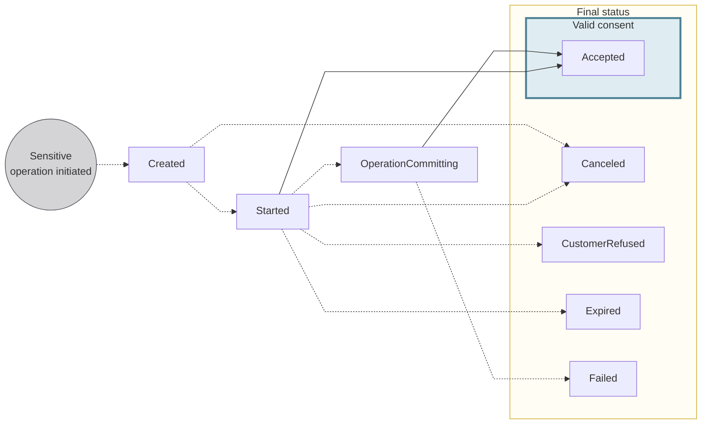

# Consent statuses

The lifecycle of a consent request, from creation through to a final status.

## Statuses {#consent-statuses}

| Consent status | Explanation |
|---|---|
| `Created` | A sensitive operation was initiated, triggering the creation of a consent request automatically. The user who needs to consent hasn't opened the consent URL yet.  |
| `Started` | The user opened the consent URL but hasn't consented yet. |
| `Accepted` | The user consented successfully. |
| `Canceled` | Consent requests can be `Canceled` by you or your user as long as the consent has a non-final status. `Canceled` also applies to child consents when a preceding child consent `Failed`. Canceling a parent multi-consent also cancels all its child consents. |
| `CustomerRefused` | The user refused to consent to the sensitive operation. |
| `Expired` | The user opened the consent URL, but didn't consent within the 20-minute validity window. This also applies if the user tries to consent but can't manage to complete a valid consent within the 20 minutes. When a parent multi-consent expires, all its child consents also expire. |
| `OperationCommitting` *(multi-consent only)* | A multi-consent was executed, and one or more child consents are still in progress.  **Next steps:**<ul><li>If consent is provided for all child consents, meaning all child consents have the status `Accepted`, the status of the multi-consent changes to `Accepted`.</li><li>If a single child consent has the status `Failed`, the multi-consent is also assigned the status `Failed`. </li></ul> |
| `Failed` | The user successfully accepted the consent, but a technical error occurred during execution. As a result, the operation didn't complete, and the user must retry.  For multi-consents, this status means a child consent `Failed`. Any child consents already `Accepted` remain valid, while unexecuted child consents are `Canceled`. |

:::info Child consent restrictions
You can't change the status of a child consent directly. 
To update a child consent, you must update the parent [multi-consent](/users/concepts/consent#multi-consent). 
:::
