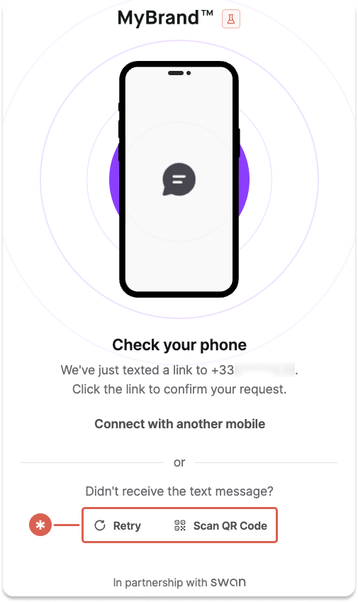

# Identifications

Swan users need to **prove their identities** at key points during their user journey: during [account onboarding](/accounts/guides/onboarding), when accepting an [account membership](/accounts/concepts/memberships), and if they need to reset their passcode.
To facilitate the process, Swan provides **secure identification options** using live video and artificial intelligence.

:::note Removing identifications
For users with non-sensitive access to accounts, defined by their [account membership permissions](/accounts/concepts/memberships/statuses#remove-identification), identification might not be necessary in some B2B situations.
:::

## Overview {#overview}

Users can complete their identification at any time, 24 hours a day, 7 days a week.
After starting the identification process, users have 10 minutes to finish before the process times out.

Identification typically involves users **presenting an identity document** and **recording their face** in order to validate the following elements:

1. Is the identity document authentic?
1. Is this person real?
1. Does the face presented actually match the identity document?

Note that users must log into Swan to access the identification process.

### Encourage identification {#encourage}

Your users have the option to complete their identification when [signing up](/users/concepts/user/sign-up) for Swan.

Swan sends your users a text message with a link they can use to start their identification.
The link can be used one time.
If the user doesn't receive the text message, they can click **Retry*** or **scan a QR code*** on the waiting page to request a new text message with the link.

After they close this waiting page, however, they can't request a new text message.

If you use Swan's Web Banking interface, your users can also start their identification from the app directly.

If your users aren't completing their identification despite these automated efforts, you can encourage them by sending an authentication link:

1. Follow the [guide to get a user access token](/build/using-api/authentication#auth-code).
1. In step 2.1, add the `identificationLevel` parameter to the `scope`.

## Levels and processes {#levels-processes}

Two key terms are essential to understand identifications at Swan: **levels** and **processes**.

- **Level**: what your users must be awarded to meet local identification regulatory requirements.
- **Process**: the specific process your users can follow to fulfill a level.

Processes vary in **strength**; in other words, there is a **hierarchy** between them.
This means that one process can award more than one level.
The process your users should complete depends on the type of account and location.

Identification levels and processes have the same names in the Swan API.
The following table **explains each process** and indicates **which levels a successful completion awards**.

import IdentificationTable from '../../../_shared/partials/_identifications-table.mdx';

<IdentificationTable />

:::note Examples
- Your user successfully completes the **PVID process**. They're awarded both **PVID** and **Expert levels**.
- Your user successfully completes the **QES** process. They're awarded both **QES** and **Expert levels**.
:::

Find the [list of identificationLevels](https://explorer.swan.io?query=cXVlcnkgTGlzdE9mTGV2ZWxzIHsKICB1c2VyKGlkOiAiJFVTRVJfSUQiKSB7CiAgICBsYXN0TmFtZQogICAgaWRlbnRpZmljYXRpb25MZXZlbHMgewogICAgICBleHBlcnQKICAgICAgUUVTCiAgICAgIFBWSUQKICAgIH0KICAgIGlkVmVyaWZpZWQKICAgIGlkCiAgICBmaXJzdE5hbWUKICAgIGJpcnRoRGF0ZQogICAgYWxsRmlyc3ROYW1lcwogICAgbmF0aW9uYWxpdHlDQ0EzCiAgICBtb2JpbGVQaG9uZU51bWJlcgogICAgc3RhdHVzCiAgfQp9Cg%3D%3D&tab=api) in the `user` query.

To start an identification, follow the [guide to get a user access token](/build/using-api/authentication#auth-code).

:::tip Choose `Auto`
Swan **recommends choosing `Auto`** *instead of a specific process* when defining the required identification level.
Doing so allows Swan to direct your users to the most appropriate identification flow for their situation.
:::

### Recommendations {#processes-recommendations}

:::info subject to approval
You need Swan's approval before you can change the user identification process in your product. To request it, contact your Strategic Account Manager (SAM).
:::

Accepted identification processes vary by country based on local regulations.
For each [account country](/accounts/concepts/account/country) and type of account, Swan recommends a process and, if possible, offers other acceptable processes.

Refer to the following table for accepted and recommended identification levels for individual and company accounts.
The first process listed is in bold with a checkmark (<Yes />), indicating it's the process Swan recommends.
Sometimes, a [first transfer](/accounts/concepts/account-holders/first-transfer) is also required.

| Account country | Individual accounts | Company accounts |
| --- | --- | --- |
| 🇫🇷 France | **<Yes /> PVID** Expert + first transfer QES | **<Yes /> Expert** QES PVID |
| 🇧🇪 Belgium | **<Yes /> QES** Expert + first transfer | **<Yes /> Expert** QES PVID |
| 🇩🇪 Germany | **<Yes /> QES + first transfer** | **<Yes /> QES** |
| 🇮🇹 Italy | **<Yes /> QES** Expert + first transfer | **<Yes /> Expert**  QES PVID |
| 🇳🇱 Netherlands | **<Yes /> Expert** QES PVID | **<Yes /> Expert** QES PVID |
| 🇪🇸 Spain | **<Yes /> QES** Expert + first transfer PVID + first transfer | **<Yes /> Expert** QES PVID |
> ∗ *Belgian citizens and foreign residents are attributed a national identification number (Rijksregisternummer/RRN in Dutch, Numéro National/NN in French). Swan must collect this identifier when a Belgian citizen or resident is the account holder or legal representative. Currently, only identity cards and residency permits are accepted for Belgian IBAN accounts. Passports will only be accepted once RRN declaration is enabled for the onboarding flow.*

import SelfEmployedRecommendations from '../../../_shared/partials/_self-employed-id-recs.mdx';

:::info Self-employed account holders
For users who are self-employed account holders, recommendations depend on their status:
<SelfEmployedRecommendations />
:::

## Tracking identifications {#tracking}

You can access all identifications performed by users who are onboarding into your project with the `user` query, which allows you to:

- Follow identifications in **real time**.
- Access a detailed **list of reasons** identifications aren't accepted. The list can help you guide users so they can successfully verify their identity.

Refer to the guides in this section for full sample queries and payloads of the `user` query.

You can also use the Event Simulator (**Dashboard** > **Developers** > **Event Simulator** > **Sandbox identifications**) to test various combinations of statuses, identification processes, and rejection reason codes.

For the full state machine and the reasons an identification can be `Invalid`, see [identification statuses](./statuses.mdx) and [invalid reason codes](./statuses.mdx#tracking-reason-codes).

## Identity documents {#levels-documents}

Swan offers an identity document sharing feature, providing access to identification **document metadata** as well as the documents themselves.
Contact your dedicated Account Manager to learn more.

## User flow diagrams {#diagrams}

  
End-user perspective of an identification process

  

    <iframe src="https://www.figma.com/embed?embed_host=share&url=https%3A%2F%2Fwww.figma.com%2Ffile%2F7K15ufXZK7Zgan770kkTmq%2FUser-flow-diagrams%3Ftype%3Ddesign%26node-id%3D1%253A1241%26mode%3Ddesign%26t%3DoGQbGo0SuPiYeJMG-1" allowFullScreen style={{width: "100%", height: 400}}></iframe>
  

