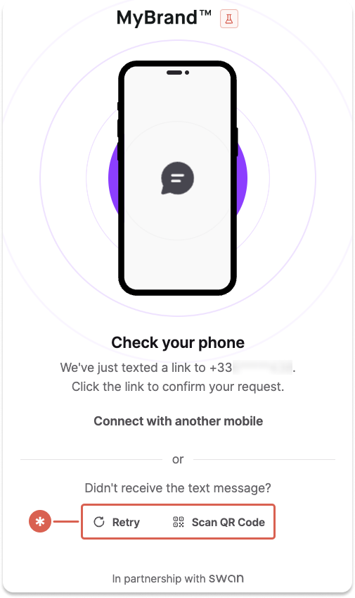

# Identifications

<p className="ia-lede">How users prove their identity, through processes that award the levels local regulation requires.</p>

Swan users need to **prove their identities** at key points during their user journey: during [account onboarding](/accounts/guides/onboarding), when accepting an [account membership](/accounts/concepts/memberships), and if they need to reset their passcode.
To facilitate the process, Swan provides **secure identification options** using live video and artificial intelligence.

:::note Removing identifications
For users with non-sensitive access to accounts, as defined by their membership permissions, identification might not be necessary in some B2B situations.
Learn more about [removing the identification requirement](/accounts/concepts/memberships/permissions#remove-identification).
:::

## How identification works {#overview}

Users can complete their identification at any time, 24 hours a day, 7 days a week.
After starting the identification process, users have a limited amount of time to finish before the identification expires.
The time limit depends on the process; refer to the `Expired` status in [identification statuses](./statuses.mdx) for the limit per process.

<Term id="identification">Identification</Term> typically involves users **presenting an identity document** and **recording their face** in order to validate the following elements:

1. Is the identity document authentic?
1. Is this person real?
1. Does the face presented actually match the identity document?

Note that users must log into Swan to access the identification process.

## Encourage identification {#encourage}

Your users have the option to complete their identification when [signing up](/users/concepts/user/sign-up) for Swan.

Swan sends your users a text message with a link they can use to start their identification.
The link can be used one time.
If the user doesn't receive the text message, they can click **Retry** or **scan a QR code** on the waiting page to request a new text message with the link.

But after they close this waiting page, they can't request a new text message.



If you use Swan's Web Banking interface, your users can also start their identification from the app directly.

If your users aren't completing their identification despite these automated efforts, you can encourage them by sending an authentication link:

1. Follow the [guide to get a user access token](/build/using-api/authentication#auth-code).
1. In step 2.1, add the `identificationLevel` parameter to the `scope`.

## Levels and processes {#levels-processes}

Two key terms are essential to understand identifications at Swan: **levels**, the credentials your users must be awarded to meet local regulatory requirements, and **processes**, the specific processes your users can follow to fulfill a level.

Refer to [identification levels and processes](./levels-processes.mdx) for the full explanation, including which levels each process awards and Swan's recommended process for each account country and account type.

## Tracking identifications {#tracking}

You can access all identifications performed by users who are onboarding into your project with the `user` query, which allows you to:

- Follow identifications in **real time**.
- Access a detailed **list of reasons** identifications aren't accepted. The list can help you guide users so they can successfully verify their identity.

Refer to the guides on [getting identifications](/users/guides/identifications/get-identifications) and [getting the latest identification](/users/guides/identifications/get-latest-id) for full sample queries and payloads of the `user` query.

You can also use the Event Simulator (**Dashboard** > **Developers** > **Event Simulator** > **Sandbox identifications**) to test various combinations of statuses, identification processes, and rejection reason codes.

For the full state machine and the reasons an identification can be `Invalid`, see [identification statuses](./statuses.mdx) and [invalid reason codes](./statuses.mdx#tracking-reason-codes).

## Identity documents {#levels-documents}

Swan offers an identity document sharing feature, providing access to identification **document metadata** as well as the documents themselves.
Contact your dedicated Account Manager to learn more.

## User flow diagrams {#diagrams}

<details>
  <summary>End-user perspective of an identification process</summary>
  <div>
    <iframe src="https://www.figma.com/embed?embed_host=share&url=https%3A%2F%2Fwww.figma.com%2Ffile%2F7K15ufXZK7Zgan770kkTmq%2FUser-flow-diagrams%3Ftype%3Ddesign%26node-id%3D1%253A1241%26mode%3Ddesign%26t%3DoGQbGo0SuPiYeJMG-1" allowFullScreen style={{width: "100%", height: 400}}></iframe>
  </div>
</details>

## In this section

```flowmap
{
  "mode": "pathway",
  "items": [
    { "title": "Levels and processes", "to": "/users/concepts/identifications/levels-processes" },
    { "title": "Identification statuses", "to": "/users/concepts/identifications/statuses" }
  ]
}
```
