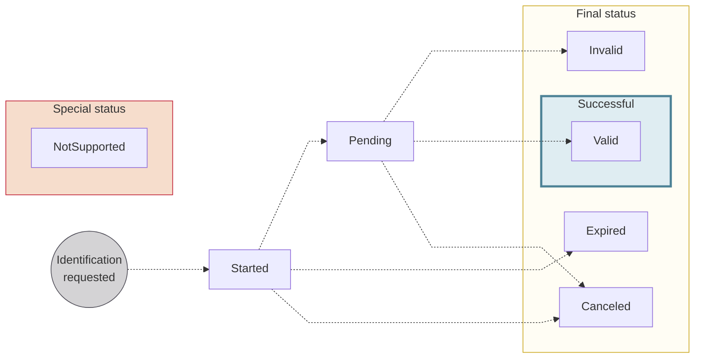

# Identification statuses

The lifecycle of an identification, and the reasons one can be rejected.

## Statuses {#statuses}

| Identification status | Explanation |
|---|---|
| `Started` | The identification request was created. The user might have begun the identification process, but they haven't completed it. Their identification is still in progress. |
| `Pending` | The user completed their portion of the identification process, and Swan identification service providers are reviewing it. |
| `Valid` | The user's identification was successful, determined by the service provider. |
| `Invalid` | The user's identification wasn't successful, determined by the service provider. |
| `Canceled` | An identification request is canceled by your user or Swan. Identifications can be canceled from any non-final status. You can't cancel an identification on your user's behalf. |
| `Expired` | After a user starts an identification, they have a limited amount of time to complete it. If time expires, the identification status changes to `Expired`.  <ul><li>Expert: 24 hours</li><li>QES: 2 hours</li><li>PVID: 15 minutes</li></ul> |
| `NotSupported` | In the API, all levels (`Expert`, `QES`, and `PVID`) are displayed. For each identification, any level that doesn't meet your requirements is marked `NotSupported`.  *For example, in an `Expert` identification, the `PVID` status is `NotSupported`.* |

## Invalid reason codes {#tracking-reason-codes}

Learn why your user's **identification** is `Invalid`.
You can also refer users to Swan's end-user [Support Center](https://support.swan.io/hc/en-150/articles/16421416513693-Identity-verification-rejection-reasons-and-solutions).

| Reason code | Explanation |
| ---- | ---- |
| `AbsentOrIncompleteFace` | The user's face must be fully present in the photo. |
| `AlteredDevice` | The device the user used was flagged as being technically modified (such as jailbreaking an iPhone). |
| `BadDocumentLighting` | The lighting on the actual document is insufficient, meaning it's either not bright enough or too bright, making information illegible. |
| `DamagedDocument` | The document is damaged in some way. It could be as minor as a bent corner. |
| `ExpiredDocument` | The expiry date of document has passed. |
| `FraudDetected` | There was an attempt to commit fraud detected. |
| `InadequateVideo` | The video quality isn't sufficient or video is missing required information. |
| `InsufficientApplicantLighting` | The lighting on the user's face is insufficient, meaning it's either not bright enough or too bright. |
| `InsufficientApplicantLiveness` | When completing challenges, the user must meet minimum movement requirements. |
| `InsufficientConnectionQuality` | The user's internet connection isn't strong enough to complete the identification process. |
| `InsufficientDocumentLiveness` | When completing challenges, the user must move their document enough to meet minimum movement requirements. |
| `InsufficientDocumentReadability` | The user's document is blurry or otherwise distorted. |
| `InsufficientFaceReadability` | The user's face is blurry or otherwise distorted. |
| `InsufficientVideoReadability` | The user's video is blurry or otherwise distorted. |
| `InternalError` | There was a technical error. Swan is unable to provide more precise information for this reason code; the user should try again. |
| `InvalidAddress` | The submitted address isn't valid or in an accepted format. |
| `InvalidOrMissingData` | The user's identification data is invalid or missing. |
| `InvoluntaryIdentification` | The user seems to be completing the identification against their will. |
| `MissingGeolocationData` | The user's geolocation data is required for this identification, but it isn't available. Often, they need to consent to share this data. |
| `NonMatchingIdentity` | The user's identity doesn't match the expected identity information based on submitted information. |
| `NonOriginalDocument` | The user submitted a duplicate of the identity document, whether digital or paper, instead of the original. |
| `SanctionsListHit` | The user appears on a sanctions list. |
| `SecondDocumentRequired` | The user must provide a second identity document. |
| `TechnicalSignatureError` | There was a technical error with the electronic signature process. The user should try again. |
| `TimeoutSignatureFlow` | The time to complete the electronic signature expired. The user should try again. |
| `UnacceptableDocument` | The document submitted by the user isn't on list of acceptable document types. |
| `UnderageApplicant` | The user is under the minimum required age. Swan account holders must be at least 18. |
| `NegativeNewsHit` | The user appears on an unacceptable news list. |
