# Signing up

Users sign up for Swan the first time they go through an [authentication](/build/using-api/authentication) link.
This typically occurs when they're invited to become an [account member](/accounts/concepts/memberships) or during the [account onboarding process](/accounts/guides/onboarding).

Your user:

1. Opens their sign-up link.
1. **Enters their phone number**.
    - If you include their number when [creating their sign-up link](/build/using-api/authentication#url-parameters-optional), they won't need to enter it again.
1. **Confirms their phone number**. How they confirm depends on whether they opened the sign-up link from a computer or their mobile device:
    1. **Desktop**: Swan sends your user a text message with a verification code. The user enters this code on their computer to confirm their phone number.
    1. **Mobile device**: Swan sends your user a text message with a verification code.
1. **Enters their personal information**: first name, last name, and birthdate. This information must match the information that appears on their identity document.
    - The user skips this step if you included this information when [creating their sign-up link](/build/using-api/authentication#url-parameters-optional).
1. **Sets a 6-digit passcode**. Users must remember their passcode. Swan can request it anytime the user needs to consent to a sensitive operation.
1. **Completes email verification** if included in the OAuth URL.
    - This step only appears if email verification was configured in the sign-up link.

:::note Identification
- If a user **isn't required** to complete identification, they can access Swan after setting their passcode.
- If a user **is required** to complete identification, they continue with steps 7-12.
:::

7. Enters their **birth information**: birth city, postal code, country, and nationality.
    - If you include this information when [creating their sign-up link](/build/using-api/authentication#url-parameters-optional), they won't need to enter it again.
1. Enters their **residency information**. Swan only requests the information required for the relevant [identification process](/users/concepts/identifications#levels-processes) (to be completed in step 9).
    - `QES` process: residency address, city, country, and postal code.
    - `PVID` or `Expert` process: residency country only.
    - If you include this information when [creating their sign-up link](/build/using-api/authentication#url-parameters-optional), they won't need to enter it again.
1. **Reviews and confirms all provided information**: personal, birth, and residency. Users can modify their information before confirming.
1. [**Completes identification**](/users/concepts/identifications), where Swan verifies their identity. This step **can be performed later**, though it's recommended to complete it as soon as possible. When using the API, you must trigger this step.
1. *(Optional)* **Sets up biometrics**, if desired and available on their mobile device. Biometrics typically include face or fingerprint authentication.
1. Gets redirected to your redirect URL.

:::note Identification rejection
If a user's identification fails, they receive a text message after completing sign-up with the **reason for the failure**. They must follow the link provided to retry. 

Share the support article on [Identification rejection reasons and solutions](https://support.swan.io/hc/en-150/articles/16421416513693-Identification-rejection-reasons-and-solutions) to help your users troubleshoot the identification process.
:::

## Sign-up diagram {#signup-diagram}

The following diagram illustrates the steps to sign up for Swan.

```mermaid
%%{ init: { 'flowchart': { 'curve': 'linear' } } }%%
flowchart TB
    MobileEntry([User sign-up started on mobile with<br/>an OAuth 2.0 link]) -.-> EntersMobileNumber([Enters mobile number])
    ComputerEntry([User sign-up started on computer with<br/>an OAuth 2.0 link]) -.-> EntersMobileNumber

    EntersMobileNumber -- User on mobile --> ConfirmsMobileNumberMobile([Confirms mobile number])
    EntersMobileNumber -- User on computer --> ReceivesOTP([Receives verification code in text message])

    ConfirmsMobileNumberMobile --> ReceivesCode([Receives verification code in text message])
    ReceivesCode --> EntersCode([Enters verification code])
    EntersCode --> QueryParams{Are query parameters filled?}
    
    ReceivesOTP --> EntersOTP([Enters verification code on computer])
    EntersOTP --> QueryParams

    QueryParams -- No --> EntersPI([Enters personal information])
    QueryParams -- Yes --> UserStartedComputer{User started sign-up on computer?}

    EntersPI --> UserStartedComputer
    UserStartedComputer -- Yes --> ConfirmsNumber([Confirms number on computer])
    ConfirmsNumber --> ChoosesPasscode([Chooses 6-digit passcode])
    UserStartedComputer -- No --> ChoosesPasscode

    ChoosesPasscode --> ConfirmsPasscode([Confirms 6-digit passcode])

    ConfirmsPasscode --> EmailVerificationIncluded{Email verification included in OAuth URL?}
    EmailVerificationIncluded -- Yes --> EmailVerificationFlow([Email verification flow])
    EmailVerificationIncluded -- No --> EntersBirthInfo

    EmailVerificationFlow --> EntersBirthInfo([Enters birth information])
    EntersBirthInfo --> EntersResidencyInfo([Enters residency information])
    EntersResidencyInfo --> ConfirmsInfo([Confirms personal, birth,<br/>and residency information])

    ConfirmsInfo --> O

    subgraph O[Optional or performed later]
        direction LR
        IV([Completes identification]) ~~~ B([Configures biometrics])
    end

    O --> S[Can access Swan]

    style S fill:#fffdf4,stroke:#cca922,stroke-width:3px
    style O fill:#E6F3F8,stroke:#4D8296,stroke-dasharray: 5 5
    style IV fill:#E6E6FA,stroke:#6A5ACD
    style B fill:#E6E6FA,stroke:#6A5ACD
    style EntersMobileNumber fill:#D4D3D5,stroke:#514F59
    style ConfirmsMobileNumberMobile fill:#D4D3D5,stroke:#514F59
    style ReceivesCode fill:#D4D3D5,stroke:#514F59
    style EntersCode fill:#D4D3D5,stroke:#514F59
    style ReceivesOTP fill:#D4D3D5,stroke:#514F59
    style EntersOTP fill:#D4D3D5,stroke:#514F59
    style ConfirmsNumber fill:#D4D3D5,stroke:#514F59
    style EntersPI fill:#D4D3D5,stroke:#514F59
    style ChoosesPasscode fill:#D4D3D5,stroke:#514F59
    style ConfirmsPasscode fill:#D4D3D5,stroke:#514F59
    style EmailVerificationFlow fill:#D4D3D5,stroke:#514F59
    style EntersBirthInfo fill:#D4D3D5,stroke:#514F59
    style EntersResidencyInfo fill:#D4D3D5,stroke:#514F59
    style ConfirmsInfo fill:#D4D3D5,stroke:#514F59
    style UserStartedComputer fill:#E6E6FA,stroke:#6A5ACD
    style QueryParams fill:#E6E6FA,stroke:#6A5ACD
```

  
End-user perspective of signing up

  

    <iframe 
  src="https://www.figma.com/embed?embed_host=share&url=https%3A%2F%2Fwww.figma.com%2Fdesign%2F7K15ufXZK7Zgan770kkTmq%2F-%25F0%259F%2593%2598--User-flow-diagrams%3Fnode-id%3D130896-30586" 
  allowfullscreen style={{width: "100%", height: 400}}>
</iframe>
  

## Accessing accounts {#signup-access}

After signing up, your user can start using Swan.
How they get to their account depends on your [integration](/get-started/set-up-swan/choose-integration):

| Integration | Access |
| --- | --- |
| No-code Web Banking | Swan redirects your user to the interface automatically. |
| Full API *or* Customized open source frontend | Your user is redirected to the `redirectUrl` you supplied when [creating their sign-up link](/build/using-api/authentication#url-parameters-optional). Make sure to declare your `redirectUrl` on your **Dashboard** > **Developers** > **Redirect URIs**. Otherwise, the redirection fails. |
