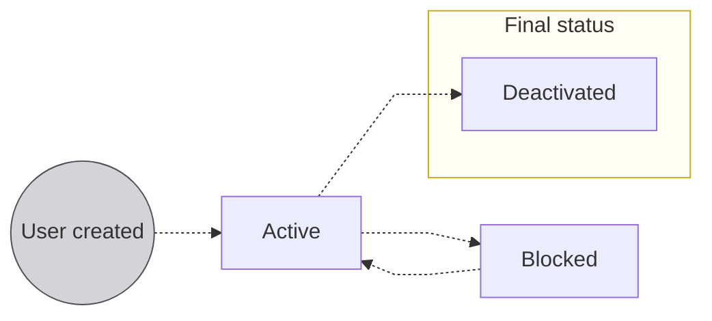

# User statuses

The lifecycle of a Swan user, from creation through to a final status.

## Statuses {#statuses}

| Status | Explanation |
|---|---|
| `Active` | Users are `Active` as soon as they're created. They can access and use Swan. |
| `Blocked` | Status assigned by Swan for security reasons.  `Blocked` users can't access or use Swan services. The phone number remains attached to the user and can't be used for someone else. In certain edge cases, `Blocked` users can return to `Active` after careful review. |
| `Deactivated` | You can deactivate users [with the API](/users/guides/user-operations/deactivate), and Swan can also assign this status.  Deactivated users can't access Swan or use Swan services. Phone numbers attached to `Deactivated` users can be assigned to someone else. |

:::caution Access tokens
[User access tokens](/build/using-api/authentication#tokens-user) associated with `Blocked` or `Deactivated` users are revoked as soon as the status changes from `Active`.
You can no longer use the API on their behalf.
You also can't use a [project access token to impersonate](/build/using-api/authentication#tokens-project) `Blocked` or `Deactivated` users. 
:::
