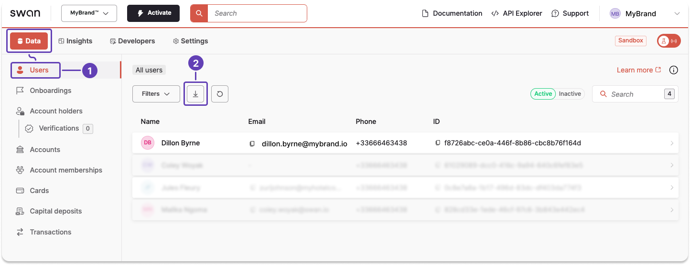

# Export user data from the Dashboard

Export the user data available on the Dashboard as a `.csv` file.

## Steps {#steps}

1. On your Dashboard, go to **Data** > **Users**.
1. Click the **download icon** to trigger a `.csv` export.
1. A modal appears. Click **Export data** to finalize the request.

After finalizing your export, a download link is sent to you by email.
Review [what happens after you export](/users/guides/user-operations/export#after-you-export).
